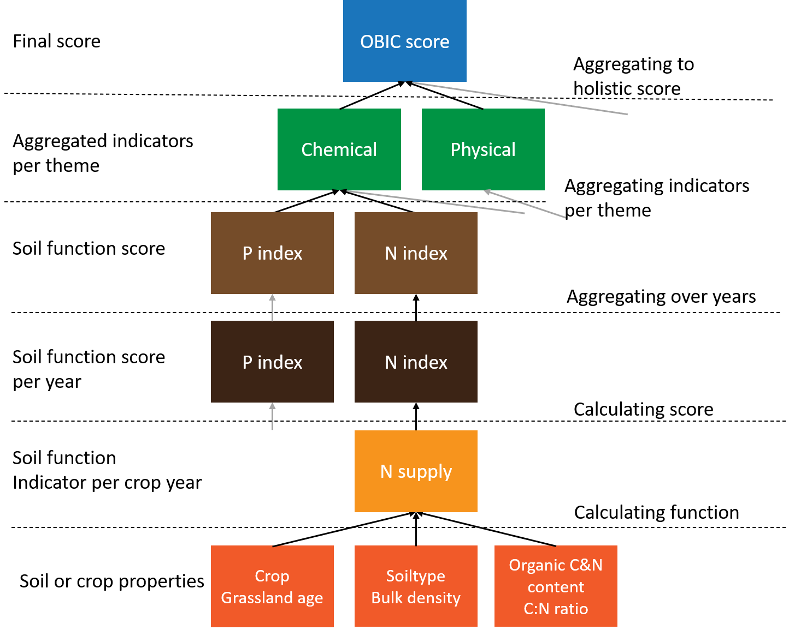
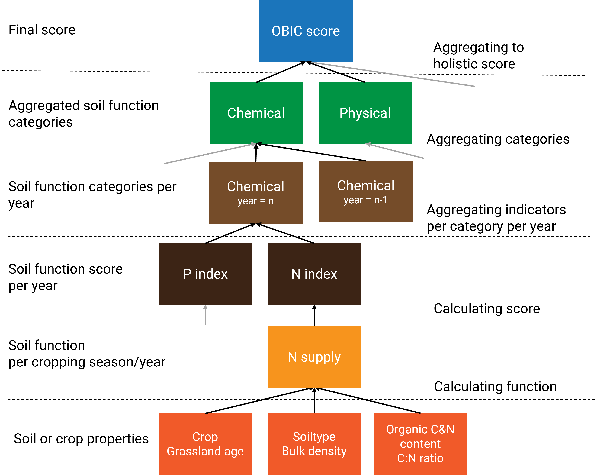

```{r, include = FALSE}
knitr::opts_chunk$set(
  collapse = TRUE,
  comment = "#>",
  warning = FALSE,
  message = FALSE
)
options(rmarkdown.html_vignette.check_title = FALSE)
```

```{r setup, include = FALSE}
  # load packages
  library(OBIC); library(data.table); library(ggplot2);require(patchwork)

  # load binnenveld data.table
  binnenveld <- as.data.table(OBIC::binnenveld)
```

---
nocite: |
  @Rinot2019, @Bunemann2018, @R-base, @R-data.table, @R-ggplot2, @R-OBIC, @R-patchwork
---


## 1. introduction

### Background
To meet the demands of a growing population, agriculture continues to intensify, along with increasing and evolving impacts on crop growth, soil quality, and environmental quality. There has been a great increase in world food production since the 1960s and an increase in per capita agricultural production, accompanied by a likewise increase in machinery and fertilizer use. Increased inputs of nitrogen and phosphorus to the soil however, has also led to substantial negative impacts on biodiversity, drinking and surface water quality, and human health. Both the agronomic potential of cropping systems as well as the environmental impacts of agriculture are highly controlled by soil properties and its management. Soil health (or soil quality) refers to the capacity of soil to function as a living ecosystem that sustains plants, animals, and humans, and support ecosystem services including agricultural production. Healthy soils are not just a growing medium for crops, they regulate and support a set of essential ecosystem services, such as water purification, carbon sequestration, nutrient cycling, and habitat provision. Improving and sustaining soil health is therefore key to sustainable crop production.

Many attempts have been made to develop indices to assess soil quality as well as related ecosystem services (reviewed by Bünemann et al., 2018; Rinot et al., 2019). To date, most of this knowledge has not been implemented in decision support tools assisting farmers for monitoring and evaluation of soil quality on farm and field level. Explicit evaluation of soil quality with respect to soil threats, soil functions, and ecosystem services has rarely been implemented. Few approaches provide clear interpretation schemes of measured indicator values. The main reason for this lack of valorization, is that soil is a complex interplay of chemical, biological, and physical processes and that the objectives for which the soil is used, have an enormous influence on the evaluation of soil quality. However, there is broad consensus that soil chemistry, soil structure, and soil biology, need to be considered for a good interpretation of soil quality. 

In order to improve and maintain soil quality while supporting sustainable agronomic production as well as other soil ecosystems services, the Open Soil Index (known by the Dutch acronym OBI from 'Open Bodem Index') was initiated in 2018. The OBI is an open source framework for assessing and valorizing soil quality and sustainable soil management. Experts from universities, consultancy companies, soil science, and farmer groups collaborated to bring together existing data from routine soil laboratories, smart data retrieval from satellites, and insights from fundamental and applied research, in a transparent and scientifically underpinned soil assessment framework. The framework is highly influenced by the Soil Management Assessment Framework [@Andrews2001;@Wienhold2004;@Wienhold2009] and the proposed holistic, multivariate soil health framework from @Rinot2019. 

### The Open Soil Index Framework
Soil quality is defined as the capacity of a soil to fulfill the desired soil functions under varying conditions for a combination of purposes (and services) such as food production, efficient nutrient cycling, and preservation of biodiversity. Soil ecosystem services are the different ecosystem services that soils can provide, being categorized as production, support, regulation, and information services. Soil functions are quantitative relationships evaluating how soil properties alone or in combination with each other contribute to the aforementioned ecosystem services. Soil indicators are the result of an evaluation scoring methodology transforming the output of soil functions to a qualitative category (low to high) or a numeric grade (1-10). Soil and field properties are characteristics of a soil (or field) that are used to quantify the soil functions. These characteristics may have been analyzed in the laboratory as well as those resulting from the location of the field in the landscape. For example, the groundwater level, the variation in ground level, the slope, and the presence of drainage are soil properties. Soil management includes all measures that land users or farmers can take to improve or adapt soil quality for a specific purpose. This has a direct influence on (measurable) soil properties. 

Within the boundary condition of context (i.e. continuation of crop rotation scheme in next decade) and objective (i.e. sustainable crop production), soil properties are quantified based on routinely available soil analyses, field properties, and remote sensing data. The soil properties are in conjunction with each other used to quantify a number of soil functions. These functions can be clustered around the three relevant aspects of soil, namely i) chemistry and nutrient supply, ii) structure and rootability and iii) biology and disease resistance. Separately from these three aspects - each of which relies heavily on actual measurements - soil management is also evaluated. Furthermore, the soil's contribution to a sustainable living environment is first and foremost indirectly included as the following soil functions: the N buffering capacity to avoid leaching and runoff, and the potential to sequester carbon.
The algorithms to evaluate and assess the quality of the soil originates from field experiments and evidence from fundamental as well as applied research. 

<br />

## 2. The Open Soil Index Calculator (OBIC)

The OBIC package makes it possible to evaluate Soil Health for a number of aggregated soil functions, evaluating a series of soil functions in relation to a "distance to target". 

### Data: Binnenveld
To explore the functionality of OBIC, we'll use the dataset `binnenveld`. The dataset contains soil properties from 11 agricultural fields in the neighborhood of Wageningen, with different soil texture and land use, and is documented in `?binnenveld`

For each field, the following properties are available:

* field properties: ID, landuse (B_LU_BRP) and agricultural region (B_AER_CBS)
* basic soil properties: soil type (B_SOILTYPE_AGR, B_HELP_WENR), risk for soil compaction (B_SC_WENR) and groundwater level (B_GWL_CLASS)
* chemical, physical and biological soil properties obtained from measurements (all variables starting with "A_")
* measurements done via a Visual Soil Assessment Form (optional, all variables starting with "A_" and ending with "BCS"). For details, see the Assessment Form of the [Bodemconditiescore](http://mijnbodemconditie.nl/aan-de-slag/download/) [@Sonneveld2014].
* soil management measures taken (optional, all variables starting with "M_")

```{r, showbinnenveld}
  dim(binnenveld)
  binnenveld[1]
```

In this example all optional input variables are set to the lowest score (for visuals soil assessment) or to false (for soil management measures). Since soil quality can only be evaluated given its use, the crop rotation plan determines also which soil properties and which soil functions are relevant and how they are evaluated given a desired threshold value.

Note that `binnenveld` is a data.table, a modern and fast variant of a data frame [@R-data.table]. It's particularly useful for large datasets because it only prints a selection of the dataset and calculations done on a data.table are extremely fast. You can learn more about data.tables at [this link](https://CRAN.R-project.org/package=data.table/vignettes/datatable-intro.html) ; in particular you can convert data frames to data.tables with as.data.table().

### Running OBIC for a single field
The main function to evaluate the quality of the soil is `obic_field()` as well as `obic_field_dt()`. Both are wrappers around the the following steps (where the latter requires a data.table as input and the former does not):

* Data preparation:
   * check format B_SC_WENR and B_GWL_CLASS
   * add default estimates for soil management measures given soil type and land use
* Estimate derivative soil properties
   * general supporting soil properties
   * soil chemical functions
   * soil physical functions
   * soil biological functions
   * soil environmental functions
   * soil management actions
   * visual soil assessment observations
* Estimate soil indicators (evaluating soil functions given a distance to target)
   * soil chemical functions
   * soil physical functions
   * soil biological functions
   * soil environmental functions
   * soil management actions
   * visual soil assessment score
* Aggregate soil indicators over the crop rotation plan
* Aggregate soil functions into more generic soil quality scores
   * for soil chemical, physical, biological and environmental soil quality (absolute)
   * for benchmarking (not yet implemented)

The process how measurable soil properties are used to evaluate the agronomic soil quality is visualized in Figure 1.

<br />

```{r, echo=FALSE, out.width = '85%', out.height = '85%', fig.cap = 'Figure 1. Graphic representation of how measured soil properties are aggregated to scores.'}
# {widht = 25%, height = 20%}

```

<br />

An example of both wrapper functions is illustrated below. The soil has an OBIC score of 0.78 indicating a relatively good quality to continue the current crop rotation plan. A value of one means that the soil quality is optimum for the continuation of the cropping plan whereas a value of zero means that there are substantial bottlenecks that need to be solved.


```{r}
  # select the relevant columns without management measures and data from Visual Soil Assessment
  cols <- colnames(binnenveld)[!grepl('_BCS$|^M_',colnames(binnenveld))]
  
  # select the first field, a grassland field 
  dt <- binnenveld[ID==1,mget(cols)]

  # run the obic_field with default management measures and no visual assessment data

  # test the obic field function via obic_field and give only the final score
  obic_field(B_SOILTYPE_AGR =  dt$B_SOILTYPE_AGR, B_GWL_CLASS =  dt$B_GWL_CLASS,
             B_SC_WENR = dt$B_SC_WENR, B_HELP_WENR = dt$B_HELP_WENR, B_AER_CBS = dt$B_AER_CBS,
             B_GWL_GLG = dt$B_GWL_GLG, B_GWL_GHG = dt$B_GWL_GHG, B_GWL_ZCRIT = dt$B_GWL_ZCRIT,
             B_DRAIN = dt$B_DRAIN, B_FERT_NORM_FR = dt$B_FERT_NORM_FR,
             B_LU_BRP = dt$B_LU_BRP, A_SOM_LOI = dt$A_SOM_LOI, A_SAND_MI = dt$A_SAND_MI,
             A_SILT_MI = dt$A_SILT_MI, A_CLAY_MI = dt$A_CLAY_MI, A_PH_CC = dt$A_PH_CC,
             A_N_RT = dt$A_N_RT, A_CN_FR = dt$A_CN_FR,
             A_S_RT = dt$A_S_RT, A_N_PMN = dt$A_N_PMN,
             A_P_AL = dt$A_P_AL, A_P_CC = dt$A_P_CC, A_P_WA = dt$A_P_WA, A_CEC_CO = dt$A_CEC_CO,
             A_CA_CO_PO = dt$A_CA_CO_PO, A_MG_CO_PO = dt$A_MG_CO_PO, A_K_CO_PO = dt$A_K_CO_PO,
             A_K_CC = dt$A_K_CC, A_MG_CC = dt$A_MG_CC, A_MN_CC = dt$A_MN_CC,
             A_ZN_CC = dt$A_ZN_CC, A_CU_CC = dt$A_CU_CC, output = 'obic_score')
  
  # test the obic field function via obic_field_dt and give only the final score
  obic_field_dt(dt,output = 'obic_score')
```

When interested in the averaged indicator value or the averaged aggregated soil indicators, one can adjust the output argument of the wrapper functions.

```{r, results = FALSE}
  # run obic_field to retrieve indicators
  obic_field_dt(dt, output = 'indicators')

  # run obic_field to retrieve aggregated scores 
  # for chemistry, biology, fysics, management and environment
  obic_field_dt(dt, output = 'scores')
  
  # the default option is to retrieve all output
  obic_field_dt(dt, output = 'all')
```


<br/>

## The Soil Functions in the OBIC
To assess the soil quality of an agricultural field, soil properties are used to derive so-called soil functions. Theses soil functions represent distinct processes in soil supporting the sustainable crop development. In this section the available soil functions are presented and illustrated.

### General supporting soil properties
Since the quality of a soil is evaluated given its crop rotation plan, soil type, and geohydrological conditions, a few general derivative soil properties are estimated. These include the calculation of bulk density, rooting depth, organic carbon stocks, the age of grassland, and the fraction that a crop contributes to the crop rotation plan. These general properties are explained below.

#### Estimate bulk density
Soil Bulk density is estimated via a pedotransferfunction using 'calc_bulk_density' currently used in Dutch fertilizer recommendation systems. It requires as input the agronomic soil type, the soil organic matter content, and the clay content of the topsoil analyzed. For details see `?calc_bulk_density`. Generally, the bulk density declines with the soil organic matter level in the soil and is higher in sandy soils compared to clayey soils.

<br />

```{r,fig.width = 7, fig.height = 4,fig.fullwidth = TRUE, echo=FALSE}
  # make a data.table for sandy and clay soil
  dt.test <- data.table(B_SOILTYPE_AGR = c(rep('dekzand',10),rep('rivierklei',10)),
                        A_SOM_LOI = c(seq(0.1,10,length.out = 10), seq(0.1,10,length.out = 10)),
                        A_CLAY_MI = c(rep(5,10),rep(25,10)))

  # estimate bulk density (D_BDS)
  dt.test[, D_BDS := calc_bulk_density(B_SOILTYPE_AGR, A_SOM_LOI, A_CLAY_MI)]
  
  # plot output
  ggplot(data = dt.test,
         aes(x = A_SOM_LOI, y = D_BDS, group = B_SOILTYPE_AGR, color = B_SOILTYPE_AGR)) + 
    geom_line() + geom_point(size=3) +  theme_bw() + scale_fill_viridis_d()+ scale_color_viridis_d()+
    ylab('Bulk density (kg / m3)') + xlab('Soil organic matter content (%)') + 
    theme(legend.position = c(0.8,0.8)) + ggtitle('Estimate bulk density from SOM and clay content') 
```


#### Estimate other general properties
Agricultural soils are frequently analyzed in routine agricultural laboratories. In the Netherlands the soil layer analyzed, is the top 25cm of an arable soil and the first 10 cm of a grassland soil. To convert soil nutrient concentrations (mg / kg) to a hectare basis, one need to know the soil depth analyzed. The OBIC function for this is a rather simple one, `calc_root_depth` where the details can be found via `?calc_root_depth`. The only input required is the crop code.

The Carbon pool in soil (kg / ha) is subsequently calculated from the soil organic matter content, the bulk density, and the sample depth via `calc_organic_carbon`. For details, see `?calc_organic_carbon`.

The age of grassland is calculated via the function `calc_grass_age` given the series of crop codes available per field. These crop codes have a temporal order with the most recent ones on top. For details, see `?calc_grass_age`.

Lastly, the relative contribution of a few crops to the full crop rotation plan over the last ten years can be estimated via the function `calc_rotation_fraction`. This function has as input the field-ID, the series of crop codes and the name of the crop for which one likes to know the relative fraction within a crop rotation plan. The following options are possible: starch, potato, sugarbeet, grass, mais, alfalfa, catchcrop, cereal, clover, nature, rapeseed, other, rustgewas, and rustgewasdiep. 

An example of these functions is illustrated below.

```{r, results = FALSE}
  # estimate soil bulk density
  dt[, D_BDS := calc_bulk_density(B_SOILTYPE_AGR, A_SOM_LOI, A_CLAY_MI)]

  # estimate soil sampling depth
  dt[, D_RD := calc_root_depth(dt$B_LU_BRP)]

  # estimate Carbon pool
  dt[, D_OC := calc_organic_carbon(A_SOM_LOI, D_BDS, D_RD)]
  
  # estimate age of grassland
  dt[,D_GA := calc_grass_age(ID, B_LU_BRP)]
  
  # estimate crop rotation fraction for sugar beet
  dt[, D_CP_SUGARBEET := calc_rotation_fraction(ID, B_LU_BRP, crop = "sugarbeet")]
```


### Calculate series of chemical soil functions
The open soil index quantifies and evaluates the capacity of the soil to supply nitrogen, phosphorus, potassium, magnesium, copper, and zinc as well as the capacity of the soil to buffer cations and the pH. The different functions are illustrated and explained below.

#### Nitrogen supplying capacity
Nitrogen is the nutrient that plants need most and is often the first limiting factor for growth. Plants take up nitrogen in mineral form as nitrate and ammonium. However, nitrogen is largely present in the soil in organic compounds. The availability of N to plants during the growing season therefore depends on the extent and rate of mineralization from the organic matter.

Nitrogen supply on grassland is derived from empirical datasets relating total N levels in soil to the N supply, depending on sampling depth, soil texture, and the age of the grassland. For arable fields, the N supply is derived from a simple first order decomposition model, calibrated for Dutch circumstances and depending on soil texture, organic matter, and total N content. 

To estimate the N supplying capacity of the soil, one can make use of the function `calc_nlv`. For more details, see `?calc_nlv`. 


```{r, results = FALSE}
  # estimate nitrogen supply (kg N / ha)
  dt[, D_NLV := calc_nlv(B_LU_BRP, B_SOILTYPE_AGR, A_N_RT, A_CN_FR, D_OC, D_BDS, D_GA)]
```


An example of this function is illustrated below for both an arable and a grassland field (left figure) as well for the relationship between total N and NLV for a grassland soil. In summary, the N supplying capacity of a soil increases with the total N present in the soil.

<br />

```{r,fig.width = 7, fig.height = 4,fig.fullwidth = TRUE,echo=FALSE}
  # define a field with two land uses: grassland and maize
  dt.test <- binnenveld[ID %in% c(1,11)]
  
  # estimate default properties needed to estimate NLV
  dt.test[, D_BDS := calc_bulk_density(B_SOILTYPE_AGR, A_SOM_LOI, A_CLAY_MI)]
  dt.test[, D_RD := calc_root_depth(B_LU_BRP)]
  dt.test[, D_OC := calc_organic_carbon(A_SOM_LOI, D_BDS, D_RD)]
  dt.test[, D_GA := calc_grass_age(ID, B_LU_BRP)]

  # estimate nitrogen supply (kg N / ha)
  dt.test[, D_NLV := calc_nlv(B_LU_BRP, B_SOILTYPE_AGR, A_N_RT, A_CN_FR, D_OC, D_BDS, D_GA)]
  
  # add group for figure
  dt.test[,luse := fifelse(ID==11,'arable','grasland')]
  
  # estimate averaged NLV for both soils
  dt.test1 <- dt.test[,list(D_NLV = mean(D_NLV)), by = 'luse']
  
   # plot output
  p1 <- ggplot(data = dt.test1,aes(y = D_NLV, x = luse, fill = luse)) + geom_col() +  theme_bw() + ylim(0,200)+
        ylab('N supplying capacity (kg N / ha)') + xlab('Landuse') + scale_fill_viridis_d()+ scale_color_viridis_d()+
        theme(legend.position = c(0.2,0.85),
              plot.title = element_text(size=10),
              legend.text = element_text(size=10),
              axis.text = element_text(size=10)) + ggtitle('N supplying capacity')
     
  
  # estimate NLV for grassland soil over range of N-total levels in soil
  dt.test2 <- dt.test[ID==1]
  
  # overwrite N levels of the soil and the soil texture to sand with a range to illustrate impact of N total on NLV
  dt.test2[,B_LU_BRP := 265]
  dt.test2[, A_N_RT := seq(100,5000,length.out = .N)]
  dt.test2[, B_SOILTYPE_AGR := 'dekzand']
  dt.test2[, D_GA := 5]
  dt.test2[, D_NLV := calc_nlv(B_LU_BRP, B_SOILTYPE_AGR, A_N_RT, A_CN_FR, D_OC, D_BDS, D_GA)]
    
  # plot output
  p2 <- ggplot(data = dt.test2,
               aes(x = A_N_RT, y = D_NLV)) + geom_line() + geom_point(size=3) + 
    theme_bw() + scale_fill_viridis_d()+ scale_color_viridis_d()+
    theme(plot.title = element_text(size=10),
              legend.text = element_text(size=10),
              axis.text = element_text(size=10))+
    ylab('N supplying capacity (kg N / ha)') + xlab('Total Nitrogen content (mg / kg)') +
    ggtitle('Relationship NLV (grasland) and N total') 

  # plot side by side
  p1 + p2
```


The total N supply is evaluated via a parabolic scoring function with an optimum of 100 kg N / ha in arable fields and 140 kg N / ha in grassland fields. The conversion from N supply to an index representing the distance to target is further explained in section

<br />

#### Phosphorus Availability Index
Phosphate (P) is present in the soil in both inorganic and organic. Inorganic P present in the soil solution is directly available for plant uptake. The amount of P in the soil solution is small compared to the total P supply of the soil. Organic P is only available to the plant after decomposition by micro-organisms. The undissolved inorganic and organic P compounds can be divided into labile and stable compounds:

* The labile P fraction is in equilibrium with the P in solution and is the main source of P re-supply to the soil solution. Labile inorganic P compounds include P bound to the surface of iron and aluminium (hydr-) oxides, and iron (Fe), aluminium (Al) and calcium phosphates. In acid and neutral soils, P availability is mainly determined by its binding to Fe and Al (hydr-) oxides. In calcareous soils, P is usually associated with calcium (Ca).
* The stable P compounds are usually poorly soluble and therefore poorly available to plants. Stable inorganic P compounds include P-containing soil minerals (e.g. apatite).

The phosphorus supply of an agricultural soil can be derived from methods measuring either a capacity or an intensity of P pools in soil or a combination of both. The latter approach is followed for grassland and maize fields, where the optimum P supply is derived from multiple field experiments across the Netherlands. For arable farming systems, the phosphorus supply is derived from one measured P pool reflecting the P status as well as controlling the crop response to P inputs. The availability is highly controlled by chemical adsorption and desorption equilibria and affected by the iron and aluminum oxides content of soils as well as the availability of oxygen. A phosphorus supply around 4.8 (unitless index, for maize and grassland fields) and 45 (mg P2O5 per liter, for arable fields)  is optimal for crop production.

To estimate the P availability of the soil, one can make use of the function `calc_phosphate_availability`. The function requires the following input: the BRP crop code and P concentration P measured via extraction of ammonium lactate (A_P_AL), water (A_P_WA) or 0.01M CaCl2 (A_P_CC). 

For more details, see `?calc_phosphate_availability`. 


```{r, results = FALSE}
  # estimate phosphate availability index (unitless)
  dt[, D_PBI := calc_phosphate_availability(B_LU_BRP, A_P_AL, A_P_CC, A_P_WA)]
```


An example of this function is illustrated below for both an arable and a grassland field (left figure) as well for the relationship between P-CaCl2 and D_PBI for a grassland soil. In this case the P capacity is left constant (so, A_P_AL is not changing) whereas the bio-available P pool is increasing from 0.5 to 10 mg P / kg.

<br />

```{r,fig.width = 7, fig.height = 4,fig.fullwidth = TRUE,echo=FALSE}
  # define a field with two landuses: grass and continue maize
  dt.test <- binnenveld[ID %in% c(1,11)]
  
  # estimate PBI
  dt.test[, D_PBI := calc_phosphate_availability(B_LU_BRP, A_P_AL, A_P_CC, A_P_WA)]
  
  # add group for figure
  dt.test[,luse := fifelse(ID==11,'arable','grasland')]
  
  # estimate averaged PBI for both soils
  dt.test1 <- dt.test[,list(D_PBI = mean(D_PBI)), by = 'luse']
  
   # plot output
  p1 <- ggplot(data = dt.test1,aes(y = D_PBI, x = luse, fill = luse)) + 
        geom_col(show.legend = FALSE) +  theme_bw() + scale_fill_viridis_d()+ scale_color_viridis_d()+
        ylab('P availability index (-)') + xlab('Landuse') + ylim(0,7)+
        theme(plot.title = element_text(size=10),
              axis.text = element_text(size=10)) + 
        ggtitle('P availability index')
     
  
  # estimate PBI for grassland soil over range of P-CaCl2 levels in soil
  dt.test2 <- dt.test[ID==1]
  
  # overwrite P-CaCl2 levels
  dt.test2[, A_P_CC := seq(0.5,10,length.out = .N)]
  dt.test2[, B_SOILTYPE_AGR := 'dekzand']
  dt.test2[, D_PBI := calc_phosphate_availability(B_LU_BRP, A_P_AL, A_P_CC, A_P_WA)]
    
  # plot output
  p2 <- ggplot(data = dt.test2,
               aes(x = A_P_CC, y = D_PBI)) + geom_line() + geom_point(size=3) +
    theme_bw() + scale_fill_viridis_d()+ scale_color_viridis_d()+
        theme(plot.title = element_text(size=10),
                  legend.text = element_text(size=10),
                  axis.text = element_text(size=10))+
        ylab('P availability index (-)') + xlab('Available P-CaCl2 (mg / kg)') +
        ggtitle('Relationship PBI (grasland) and P-CaCl2') 

  # plot side by side
  p1 + p2
```


#### Potassium supply
Like N and P, potassium (K) an important element for crop growth. Potassium is almost exclusively present in the soil in mineral form. The amount of K in the soil can be divided into 4 fractions:
* K^+- ions in the soil solution; completely and directly available to the plant, but insufficient to cover the needs of the crop
* K-exchangeable; K adsorbed to the clay and humus particles (adsorption complex; CEC). The exchange between K in the soil solution and K adsorbed occurs rapidly: within minutes to 24 hours
* K-fixed or bound (in clay soils); the K enclosed in the clay plates. Exchange between K-fixed and K-soil solution takes days to months
* K-mineral or K rock; becomes available through weathering. The amount of K that becomes available through weathering during a growing season is too small to be of agricultural interest.

The K supply is strongly controlled by the distribution of K over the possible K pools in soil, being controlled by adsorption and desorption processes, the cation exchange capacity of the soil and competing ions in soil solution and present at the exchange complex. Building on agronomic research from the last decade, the K supply is quantified for grasslands using the plant available K fraction (measured via CaCl2-extraction, K-CaCl2) as well as the CEC. For maize it is quantified using K-CaCl2 and for arable fields its quantified from K-CaCl2 and the CEC while accounting for the clay content, the organic matter content and the pH of the soil. 

To estimate the K supplying capacity of the soil, one can make use of the function `calc_potassium_availability`. The function requires the following input: the BRP crop code, the soil type, the organic matter content, the clay content, the pH, the cation exchange capacity (CEC), the occupation of the CEC with potassium (%) and the directly available concentration of K as determined with a soil extraction with 0.01M CaCl2. 

For more details, see `?calc_potassium_availability`. 


```{r, results = FALSE}
  # estimate potassium availability index (unitless)
  dt[, D_K :=  calc_potassium_availability(B_LU_BRP, B_SOILTYPE_AGR, A_SOM_LOI, A_CLAY_MI, 
                                           A_PH_CC, A_CEC_CO, A_K_CO_PO, A_K_CC)]
```


An example of this function is illustrated below for both an arable and a grassland field (left figure) as well for the relationship between K-CaCl2 and D_K for a grassland soil. In this case the occupation of the CEC with K is left constant (so, A_K_CO_PO is not changing) whereas the bio-available K pool is increasing from 5 to 500 mg K / kg.

<br />

```{r,fig.width = 7, fig.height = 4,fig.fullwidth = TRUE,echo=FALSE}
  # define a field with two landuses: grassland and maize
  dt.test <- binnenveld[ID %in% c(1,11)]
  
  # estimate K-availability index
  dt.test[, D_K :=  calc_potassium_availability(B_LU_BRP, B_SOILTYPE_AGR, A_SOM_LOI, A_CLAY_MI, 
                                           A_PH_CC, A_CEC_CO, A_K_CO_PO, A_K_CC)]
  
  # add group for figure
  dt.test[,luse := fifelse(ID==11,'arable','grasland')]
  
  # estimate averaged K-availability indices for both soils
  dt.test1 <- dt.test[,list(D_K = mean(D_K)), by = 'luse']
  
   # plot output
  p1 <- ggplot(data = dt.test1,aes(y = D_K, x = luse, fill = luse)) + 
        geom_col(show.legend = FALSE) +  theme_bw() + scale_fill_viridis_d()+ scale_color_viridis_d()+
        ylab('K availability index (-)') + xlab('Landuse') + 
        theme(plot.title = element_text(size=10),
              axis.text = element_text(size=10)) + 
        ggtitle('K availability index')
     
  
  # estimate K-supply for grassland soil over range of K-CaCl2 levels in soil
  dt.test2 <- dt.test[ID==1]
  
  # overwrite K-CaCl2 levels
  dt.test2[, A_K_CC := seq(5,500,length.out = .N)]
  dt.test2[, B_SOILTYPE_AGR := 'dekzand']
  dt.test2[, D_K :=  calc_potassium_availability(B_LU_BRP, B_SOILTYPE_AGR, A_SOM_LOI, A_CLAY_MI, 
                                           A_PH_CC, A_CEC_CO, A_K_CO_PO, A_K_CC)]
    
  # plot output
  p2 <- ggplot(data = dt.test2,
               aes(x = A_K_CC, y = D_K)) + geom_line() + geom_point(size=3) + 
    theme_bw() + scale_fill_viridis_d()+ scale_color_viridis_d()+
        theme(plot.title = element_text(size=10),
                  legend.text = element_text(size=10),
                  axis.text = element_text(size=10))+
        ylab('K availability index (-)') + xlab('Available K-CaCl2 (mg / kg)') +
        ggtitle('Relationship K-availability (grasland) and K-CaCl2') 

  # plot side by side
  p1 + p2
```


#### Sulfur supply
Sulfur (S) is needed - along with nitrogen - for the formation of proteins in the plant. Whether S supply from the soil is sufficient for optimal production and quality depends on the crop's S requirements and the S supply in the soil. The S supply is  determined by soil processes and external sulfur supplies to the soil.

The amount of sulfur in the soil that is available for crop uptake is determined by the mineral sulfur supply remaining in the soil after winter (Smin), mineralization of sulfur in the soil during the growing season (sulfur supply capacity), sulfur deposition, sulfur supply by irrigation during cultivation, capillary rise of sulfur-containing groundwater, and by possible losses. Sulfur supply, capillary rise, and Smin are quantitatively the most important inputs of sulfur. However, all three can vary considerably. The contribution from sulfur deposition is only minor throughout the Netherlands. A substantial amount of sulfur can also be supplied through irrigation with sulfurous spring water. This supply, however, varies greatly, depending on the amount sprayed and the sulfur content of the water.

To estimate the S supplying capacity of the soil, one can make use of the function `calc_slv`. The function requires the following input: the BRP crop code, the soil type, the agricultural region within the Netherlands (used to estimate default S deposition rates), the organic matter content, the total S content of the soil, and the bulk density. 

For more details, see `?calc_slv`. 


```{r, results = FALSE}
  # estimate S supplying capacity
  dt[, D_SLV := calc_slv(B_LU_BRP, B_SOILTYPE_AGR, B_AER_CBS,A_SOM_LOI,A_S_RT, D_BDS)]
```


An example of this function is illustrated below for both an arable and a grassland field (left figure) as well for the relationship between total S and D_SLV for a grassland soil. In this case all soil properties driving S supplying capacity are left constant whereas the total S pool is increasing from 500 to 5000 mg S / kg.


<br/>

```{r,fig.width = 7, fig.height = 4,fig.fullwidth = TRUE,echo=FALSE}
  # define a field with two landuses: grassland and maize
  dt.test <- binnenveld[ID %in% c(1,11)]
  
  # estimate bulk density
  dt.test[, D_BDS := calc_bulk_density(B_SOILTYPE_AGR, A_SOM_LOI, A_CLAY_MI)]

  # estimate Mg-availability index
  dt.test[,D_SLV := calc_slv(B_LU_BRP, B_SOILTYPE_AGR, B_AER_CBS,A_SOM_LOI,A_S_RT, D_BDS)]
  
  # add group for figure
  dt.test[,luse := fifelse(ID==11,'arable','grasland')]
  
  # estimate averaged SLV for both soils
  dt.test1 <- dt.test[,list(D_SLV = mean(D_SLV)), by = 'luse']
  
   # plot output
  p1 <- ggplot(data = dt.test1,aes(y = D_SLV, x = luse, fill = luse)) + 
        geom_col(show.legend = FALSE) +  theme_bw() + scale_fill_viridis_d()+ scale_color_viridis_d()+
        ylab('S supplying capacity (kg S / ha)') + xlab('Landuse') + 
        theme(plot.title = element_text(size=10),
              axis.text = element_text(size=10)) + 
        ggtitle('S supplying capacity (kg S / ha)')
     
  
  # estimate SLV for grassland soil over range of total S levels in soil
  dt.test2 <- dt.test[ID==1]
  
  # overwrite A_S_RT levels
  dt.test2[, A_S_RT := seq(500,5000,length.out = .N)]
  dt.test2[, B_SOILTYPE_AGR := 'dekzand']
  dt.test2[, D_SLV := calc_slv(B_LU_BRP, B_SOILTYPE_AGR, B_AER_CBS,A_SOM_LOI,A_S_RT, D_BDS)]
    
  # plot output
  p2 <- ggplot(data = dt.test2,
               aes(x = A_S_RT, y = D_SLV)) + geom_line() + geom_point(size=3) + 
    theme_bw() + scale_fill_viridis_d()+ scale_color_viridis_d()+
        theme(plot.title = element_text(size=10),
                  legend.text = element_text(size=10),
                  axis.text = element_text(size=10))+
        ylab('S supplying capacity (kg S / ha)') + xlab('total S (mg / kg)') +
        ggtitle('Relationship SLV (grasland) and total S') 

  # plot side by side
  p1 + p2
```


#### Magnesium supply
Magnesium is an important element for crop growth, livestock health, and livestock productivity.
Deficiencies for magnesium often occur on sandy soils with low organic matter and low pH. The supply of Mg for arable fields as well as grassland fields on sandy soils is directly related to the plant available Mg-content (Mg-CaCl2). For grassland fields on clay and peat soils the Mg-supply is indirectly quantified given the required composition of the grass (for intake by cows) and depends on the CEC, the organic matter and clay content, pH, as well as the K-availability assessed by K-CaCl2 and K-CEC. 

To estimate the Mg supplying capacity of the soil, one can make use of the function `calc_magnesium_availability`. The function requires the following input: the BRP crop code, the soil type, the organic matter content, the clay content, the pH, the cation exchange capacity (CEC), the occupation of the CEC with potassium (%) and the directly available concentration of both Mg and K as determined with a soil extraction with 0.01M CaCl2. 

For more details, see `?calc_magnesium_availability`. 


```{r, results = FALSE}
  # estimate magnesium availability index (unitless)
  dt[, D_MG := calc_magnesium_availability(B_LU_BRP, B_SOILTYPE_AGR, A_SOM_LOI, 
                                           A_CLAY_MI, A_PH_CC, A_CEC_CO,
                                           A_K_CO_PO, A_MG_CC, A_K_CC)]
```


An example of this function is illustrated below for both an arable and a grassland field (left figure) as well for the relationship between Mg-CaCl2 and D_MG for a grassland soil. In this case all soil properties driving Mg availability in soil are left constant whereas the bio-available Mg pool is increasing from 5 to 500 mg Mg / kg.

<br />

```{r,fig.width = 7, fig.height = 4,fig.fullwidth = TRUE,echo=FALSE}
  # define a field with two landuses: grassland and maize
  dt.test <- binnenveld[ID %in% c(1,11)]
  
  # estimate Mg-availability index
  dt.test[, D_MG := calc_magnesium_availability(B_LU_BRP, B_SOILTYPE_AGR, A_SOM_LOI, 
                                           A_CLAY_MI, A_PH_CC, A_CEC_CO,
                                           A_K_CO_PO, A_MG_CC, A_K_CC)]
  
  # add group for figure
  dt.test[,luse := fifelse(ID==11,'arable','grasland')]
  
  # estimate averaged Mg-availability indices for both soils
  dt.test1 <- dt.test[,list(D_MG = mean(D_MG)), by = 'luse']
  
   # plot output
  p1 <- ggplot(data = dt.test1,aes(y = D_MG, x = luse, fill = luse)) + 
        geom_col(show.legend = FALSE) +  theme_bw() + scale_fill_viridis_d()+ scale_color_viridis_d()+
        ylab('Mg availability index (-)') + xlab('Landuse') + 
        theme(plot.title = element_text(size=10),
              axis.text = element_text(size=10)) + 
        ggtitle('Mg availability index')
     
  
  # estimate Mg-supply for grassland soil over range of Mg-CaCl2 levels in soil
  dt.test2 <- dt.test[ID==1]
  
  # overwrite Mg-CaCl2 levels
  dt.test2[, A_MG_CC := seq(5,500,length.out = .N)]
  dt.test2[, B_SOILTYPE_AGR := 'dekzand']
  dt.test2[, D_MG := calc_magnesium_availability(B_LU_BRP, B_SOILTYPE_AGR, A_SOM_LOI, 
                                           A_CLAY_MI, A_PH_CC, A_CEC_CO,
                                           A_K_CO_PO, A_MG_CC, A_K_CC)]
    
  # plot output
  p2 <- ggplot(data = dt.test2,
               aes(x = A_MG_CC, y = D_MG)) + geom_line() + geom_point(size=3) + 
    theme_bw() + scale_fill_viridis_d()+ scale_color_viridis_d()+
        theme(plot.title = element_text(size=10),
                  legend.text = element_text(size=10),
                  axis.text = element_text(size=10))+
        ylab('Mg availability index (-)') + xlab('Available Mg-CaCl2 (mg / kg)') +
        ggtitle('Relationship Mg-availability (grasland) and Mg-CaCl2') 

  # plot side by side
  p1 + p2
```


#### Copper supply
Copper (Cu) occurs in soil solution largely in a complexed form, mainly with dissolved organic matter. Root uptake of Cu probably occurs as free Cu ions (Cu2+). The availability of complexed Cu for uptake is lower than that of Cu2+ and depends on the stability of the complex. Complexation of Cu, however, may increase the mobility of Cu in soils. Besides complexation of Cu to dissolved or solid organic matter, Cu can be adsorbed to Fe-, Al-, and Mn-(hydr)oxideclay minerals. Cu desorbed from the mentioned soil components is available for uptake. The degree of adsorption increases at higher pH, which decreases the availability. Other factors that influence Cu availability are nitrogen and phosphate content. Nitrogen and Cu show positive interactions. Decreasing N use will lead to lower levels in crops. Phosphate can drive Cu away from the adsorption sites and this leads to Cu deficiency in the long run.

The supply and availability of Cu depends on the plant available Cu-pool in soil (Cu-CaCl2) or the reactive Cu pool (Cu-HNO3) for both arable and grassland soils. The optimum value is derived from historical field experiments and is established on a level of 5 to 10 mg / kg. The risk of Cu deficiency can be calculated based on the Cu content in the soil and relevant soil characteristics that influence its availability. The following measurements are used to calculate Cu plant availability: land use, Cu-CaCl2, clay content, the organic matter content, and the plant extractable levels of K and Mn. The last soil properties are used for an empirical function to estimate Cu-HNO3 (the basis for fertilizer recommendations based on long-term field experiments) from Cu-CaCl2 (being currently measured in agricultural laboratories). In OBIC, one can make use of the function `calc_copper_availability`. The function requires the input mentioned above. 

For more details, see `?calc_copper_availability`. 


```{r, results = FALSE}
  # estimate Cu availability index
  dt[, D_CU := calc_copper_availability(B_LU_BRP, A_SOM_LOI, A_CLAY_MI, A_K_CC, A_MN_CC, A_CU_CC)]
```


An example of this function is illustrated below for both an arable and a grassland field (left figure) as well for the relationship between Cu-CaCl2 and D_CU for a grassland soil. In this case all soil properties driving Cu availability in soil are left constant whereas the bio-available Cu pool is increasing from 5 to 500 ug Cu / kg.

<br />

```{r,fig.width = 7, fig.height = 4,fig.fullwidth = TRUE,echo=FALSE}
  # define a field with two landuses: grassland and maize
  dt.test <- binnenveld[ID %in% c(1,11)]
  
  # estimate Cu-availability index
  dt.test[, D_CU := calc_copper_availability(B_LU_BRP, A_SOM_LOI, A_CLAY_MI, A_K_CC, A_MN_CC, A_CU_CC)]
  
  # add group for figure
  dt.test[,luse := fifelse(ID==11,'arable','grasland')]
  
  # estimate averaged Cu-availability indices for both soils
  dt.test1 <- dt.test[,list(D_CU = mean(D_CU)), by = 'luse']
  
   # plot output
  p1 <- ggplot(data = dt.test1,aes(y = D_CU, x = luse, fill = luse)) + 
        geom_col(show.legend = FALSE) +  theme_bw() + scale_fill_viridis_d()+ scale_color_viridis_d()+
        ylab('Cu availability index (-)') + xlab('Landuse') + 
        theme(plot.title = element_text(size=10),
              axis.text = element_text(size=10)) + 
        ggtitle('Cu availability index')
     
  
  # estimate Cu-supply for grassland soil over range of Cu-CaCl2 levels in soil
  dt.test2 <- dt.test[ID==1]
  
  # overwrite Cu-CaCl2 levels
  dt.test2[, A_CU_CC := seq(5,500,length.out = .N)]
  dt.test2[, B_SOILTYPE_AGR := 'dekzand']
  dt.test2[, D_CU := calc_copper_availability(B_LU_BRP, A_SOM_LOI, A_CLAY_MI, A_K_CC, A_MN_CC, A_CU_CC)]
    
  # plot output
  p2 <- ggplot(data = dt.test2,
               aes(x = A_CU_CC, y = D_CU)) + geom_line() + geom_point(size=3) + 
    theme_bw() + scale_fill_viridis_d()+ scale_color_viridis_d()+
        theme(plot.title = element_text(size=10),
                  legend.text = element_text(size=10),
                  axis.text = element_text(size=10))+
        ylab('Cu availability index (-)') + xlab('Available Cu-CaCl2 (ug / kg)') +
        ggtitle('Relationship Cu-availability (grasland) and Cu-CaCl2') 

  # plot side by side
  p1 + p2
```


#### Zinc supply
The processes involved in the behavior of zinc (Zn) in soil are the same as for Cu. Besides Zn2+, Zn occurs in the soil solution in complex form with dissolved organic matter. Binding of Zn to solid soil constituents occurs to clay minerals, metal (hydr)oxides, and solid organic matter. The affinity of Zn for binding to these materials is lower than that of Cu. Zinc is taken up by plant roots as Zn2+. Because the concentration of Zn2+ in the soil solution is low and Zn is not very mobile, it is only transported over short distances. Therefore, a sufficiently large root system is very important for a good Zn uptake. The development of the root system is strongly influenced by the phosphate supply of the crop. In herbaceous crops, the secretion of phytosiderophores in response to a Fe or Zn deficiency strongly increases Zn uptake. These organic compounds complex Zn and increase Zn mobility in the soil, which facilitates Zn transport to the root and uptake as Zn2+. A high pH, cold and wet conditions and a lot of organic matter in the soil decrease the availability of Zn.

The supply of zinc depends on the plant availability of Zn such as determined via CaCl2 extraction method (Zn-CaCl2), while accounting for soil type, land use and pH. Critical threshold values for Zn has been derived from optimum Zn contents of the growing crop. In OBIC, one can make use of the function `calc_zinc_availability`. The function requires the following input: land use, soil type, pH, and the bioavailable Zn-content as measured via n extraction with 0.01M CaCl2. 

For more details, see `?calc_zinc_availability`. 


```{r, results = FALSE}
  # estimate Zn availability index
  dt[,  D_ZN := calc_zinc_availability(B_LU_BRP, B_SOILTYPE_AGR, A_PH_CC, A_ZN_CC)]
```


An example of this function is illustrated below for both an arable and a grassland field (left figure) as well for the relationship between Zn-CaCl2 and D_ZN for a grassland soil. In this case all soil properties driving Zn availability in soil are left constant whereas the bio-available Zn pool is increasing from 50 to 5000 ug Zn / kg.

<br />

```{r,fig.width = 7, fig.height = 4,fig.fullwidth = TRUE,echo=FALSE}
  # define a field with two landuses: grassland and maize
  dt.test <- binnenveld[ID %in% c(1,11)]
  
  # estimate Zn-availability index
  dt.test[, D_ZN := calc_zinc_availability(B_LU_BRP, B_SOILTYPE_AGR, A_PH_CC, A_ZN_CC)]
  
  # add group for figure
  dt.test[,luse := fifelse(ID==11,'arable','grasland')]
  
  # estimate averaged Zn-availability indices for both soils
  dt.test1 <- dt.test[,list(D_ZN = mean(D_ZN)), by = 'luse']
  
   # plot output
  p1 <- ggplot(data = dt.test1,aes(y = D_ZN, x = luse, fill = luse)) + 
        geom_col(show.legend = FALSE) +  theme_bw() + scale_fill_viridis_d()+ scale_color_viridis_d()+
        ylab('Zn availability index (-)') + xlab('Landuse') + 
        theme(plot.title = element_text(size=10),
              axis.text = element_text(size=10)) + 
        ggtitle('Zn availability index')
     
  
  # estimate Zn-supply for grassland soil over range of Zn-CaCl2 levels in soil
  dt.test2 <- dt.test[ID==1]
  
  # overwrite Zn-CaCl2 levels
  dt.test2[, A_ZN_CC := seq(50,5000,length.out = .N)]
  dt.test2[, B_SOILTYPE_AGR := 'dekzand']
  dt.test2[, D_ZN := calc_zinc_availability(B_LU_BRP, B_SOILTYPE_AGR, A_PH_CC, A_ZN_CC)]
    
  # plot output
  p2 <- ggplot(data = dt.test2,
               aes(x = A_ZN_CC, y = D_ZN)) + geom_line() + geom_point(size=3) + 
    theme_bw() + scale_fill_viridis_d()+ scale_color_viridis_d()+
        theme(plot.title = element_text(size=10),
                  legend.text = element_text(size=10),
                  axis.text = element_text(size=10))+
        ylab('Zn availability index (-)') + xlab('Available Zn-CaCl2 (ug / kg)') +
        ggtitle('Relationship Zn-availability (grasland) and Zn-CaCl2') 

  # plot side by side
  p1 + p2
```


#### Soil Acidity
The pH is a measure of the acidity of the soil. The pH influences the soil quality and crop growth, among others through availability of nutrients and (heavy) metals and activity of soil life. In addition, the pH also influences various soil functions such as nutrient buffering and aggregate stability. The optimum soil pH for crop growth differs per crop. Potatoes prefer a lower pH and cereals, maize, sugar beet, and field vegetables a higher pH. Organic matter reduces the negative effect of pH on crop growth. On sandy soils with an organic matter content of 15%, the desired pH can be up to half a unit lower than on low organic matter content soils. On clay soils the desired pH is higher than on sandy soils. With a clay percentage above 10, the desired pH is half a unit higher than with low clay percentages.

The optimum pH is determined in historical field experiments given crop rotation plan, soil texture, soil organic matter, and initial pH. The derivation of the optimum pH can be estimated via the OBIC using the function `calc_ph_delta`. This function estimates how much the pH has to increase by liming to be optimum for crop development. The original empirical relationships are based on pH measurements done in KCl-extraction. Since the current pH analysis methods all make use of 0.01M CaCl2, this pH value can easily be transformed to pH-KCl given an empirical relationship between both. 

For more details, see `?calc_ph_delta`. 


```{r, results = FALSE, eval = FALSE}
  # estimate distance to required pH
  dt[, D_PH_DELTA := calc_ph_delta(B_LU_BRP, B_SOILTYPE_AGR, A_SOM_LOI, A_CLAY_MI, A_PH_CC, D_CP_STARCH,
                                   D_CP_POTATO, D_CP_SUGARBEET, D_CP_GRASS, D_CP_MAIS, D_CP_OTHER)]
```


An example of this function is illustrated below for both an arable and a grassland field (left figure) as well for the relationship between the initial and desired pH change for a grassland soil. In this case all soil properties driving pH in soil are left constant whereas the initial pH is increasing from 3 to 10.

<br />

```{r,fig.width = 7, fig.height = 4,fig.fullwidth = TRUE,echo=FALSE}
  # define a field with two landuses: grassland and maize
  dt.test <- binnenveld[ID %in% c(1,11)]
  
  # Calculate the crop rotation fraction
  dt.test[, D_CP_STARCH := calc_rotation_fraction(ID, B_LU_BRP, crop = "starch")]
  dt.test[, D_CP_POTATO := calc_rotation_fraction(ID, B_LU_BRP, crop = "potato")]
  dt.test[, D_CP_SUGARBEET := calc_rotation_fraction(ID, B_LU_BRP, crop = "sugarbeet")]
  dt.test[, D_CP_GRASS := calc_rotation_fraction(ID, B_LU_BRP, crop = "grass")]
  dt.test[, D_CP_MAIS := calc_rotation_fraction(ID, B_LU_BRP, crop = "mais")]
  dt.test[, D_CP_OTHER := calc_rotation_fraction(ID, B_LU_BRP, crop = "other")]
    
  # estimate delta-pH
  dt.test[, D_PH_DELTA := calc_ph_delta(B_LU_BRP, B_SOILTYPE_AGR, A_SOM_LOI, A_CLAY_MI, A_PH_CC, D_CP_STARCH,
                                   D_CP_POTATO, D_CP_SUGARBEET, D_CP_GRASS, D_CP_MAIS, D_CP_OTHER)]
  
  # add group for figure
  dt.test[,luse := fifelse(ID==11,'arable','grasland')]
  
  # estimate averaged delta-pH for both soils
  dt.test1 <- dt.test[,list(D_PH_DELTA = mean(D_PH_DELTA)), by = 'luse']
  
   # plot output
  p1 <- ggplot(data = dt.test1,aes(y = D_PH_DELTA, x = luse, fill = luse)) + 
        geom_col(show.legend = FALSE) +  theme_bw() + scale_fill_viridis_d()+ scale_color_viridis_d()+
        ylab('desired pH-change (-)') + xlab('Landuse') + 
        theme(plot.title = element_text(size=10),
              axis.text = element_text(size=10)) + 
        ggtitle('desired pH-change (-)')
     
  
  # estimate desired pH-change for grassland soil over range of pH levels in soil
  dt.test2 <- dt.test[ID==1]
  
  # overwrite initial pH
  dt.test2[, A_PH_CC := seq(3,10,length.out = .N)]
  dt.test2[, B_SOILTYPE_AGR := 'dekzand']
  dt.test2[, D_PH_DELTA := calc_ph_delta(B_LU_BRP, B_SOILTYPE_AGR, A_SOM_LOI, A_CLAY_MI, A_PH_CC, D_CP_STARCH,
                                   D_CP_POTATO, D_CP_SUGARBEET, D_CP_GRASS, D_CP_MAIS, D_CP_OTHER)]
    
  # plot output
  p2 <- ggplot(data = dt.test2,
               aes(y = D_PH_DELTA, x = A_PH_CC)) + geom_line() + geom_point(size=3) +  
    theme_bw() + scale_fill_viridis_d()+ scale_color_viridis_d()+
        theme(plot.title = element_text(size=10),
                  legend.text = element_text(size=10),
                  axis.text = element_text(size=10))+
        ylab('desired pH-change (-)') + xlab('pH value') +
        ggtitle('Relationship desired pH-change and pH') 

  # plot side by side
  p1 + p2
```


#### Soil Cation Buffering
For good crop growth, sufficient nutrients must be available. Besides the actual nutrient availability in soil solution, the capacity of a soil to buffer nutrients is important to identify potential bottlenecks for crop production. fertilization is needed when the buffering capacity or speed of replenishment is insufficient. Soils can vary greatly in their buffer capacity.  Cations are adsorbed to negatively charged soil particles (clay, organic matter, and oxides) and these cations may become available through exchange. For example, a growing plant extracts K+ from the soil solution. The adsorption complex will start to resupply because the amount of K+ in the soil solution has decreased. Once again, a balance is established between the K+ concentration in the soil solution and the quantity of K+ adsorbed. In practice, soils with a higher CEC are usually more fertilized and there is a lower risk of cation deficiencies during the growing season. In general, the optimum CEC value is around 100 mmol+/kg. CEC levels below 30-40 mmol+/kg are characterized by substantial crop limitation whereas values above 100 have no positive impact any more. The scientific underpinning of these guidelines is still poor. In OBIC the soil fertility is positively assessed in relation to the CEC and can be evaluated with the OBIC function `calc_cec`.

For more details, see `?calc_cec`. 


```{r, results = FALSE, eval = FALSE}
  # estimate importance of CEC supporting crop development
  dt[, D_CEC := calc_cec(A_CEC_CO)]
```

```{r,fig.width = 7, fig.height = 4,fig.fullwidth = TRUE,echo=FALSE, eval = FALSE}
  # Make a data table with CEC levels between 1 and 100 mmol+/kg
  dt <- data.table(A_CEC_CO = seq(1,100,1))
    
  # Add D_CEC
  dt[,D_CEC := calc_cec(A_CEC_CO)]
    
  # plot output
  p1 <- ggplot(data = dt,aes(y = D_CEC, x = A_CEC_CO)) + 
        geom_point(show.legend = FALSE) + geom_line()+ theme_bw() + scale_fill_viridis_d()+ scale_color_viridis_d()+
        ylab('CEC evaluation') + xlab('Cation exchange capacity') + 
        theme(plot.title = element_text(size=10),
              axis.text = element_text(size=10)) + 
        ggtitle('')
    
   p1
```

### Calculate series of physical soil functions
The open soil index quantifies and evaluates a series of physical soil functions related to the supply of water and the rootability of the top and subsoil. The different soil physical functions are illustrated and explained below. Soil physical functions include the capacity of soils to retain and supply water, to resist wind erosion, topsoil sealing, subsoil compaction, and to deliver bearing capacity for mechanic activities 

#### Water Stress due to drought or wetness
The supply of water is of uttermost importance for crop development. The water supply depends on weather conditions and the capacity of soils to buffer and supply water during the growing season. Using long-term field experiments for multiple crops, empirical relationships between soil texture, ground water levels, and yield depressions due to drought or too wet conditions have been developed (Van Bakel, 2005; Huinink, 2018). Within OBIC the crop yield response to drought stress or wetnessstress can be estimated via the function `calc_waterstressindex`, requiring as input a soil code (representing unique combinations of soil type and geohydrological conditions controlling water availability), crop type, and groundwater level.

For more details, see `?calc_waterstressindex`. 


```{r, results = FALSE, eval = FALSE}
  # reformat GWL_CLASS
  dt[, B_GWL_CLASS := format_gwt(B_GWL_CLASS)]

  # estimate risk on yield reduction to drought stress or wetness stress
  dt[, D_WSI_DS := calc_waterstressindex(B_HELP_WENR, B_LU_BRP, B_GWL_CLASS, WSI = 'droughtstress')]
  dt[, D_WSI_WS := calc_waterstressindex(B_HELP_WENR, B_LU_BRP, B_GWL_CLASS, WSI = 'wetnessstress')]
```


An example of this function is illustrated below for both an sandy and a clay soil given variation in the groundwater levels. In the left figure the yield reduction to drought stress (D_WSI_DS, red) and wetness stress (D_WSI_WS, green) are estimated for five fields with different soil types and crops. In the right figure the impact of variable groundwater dynamics are estimated for a single field.

<br/>


```{r,fig.width = 7, fig.height = 4,fig.fullwidth = TRUE,echo=FALSE}
  # subset a series of agricultural fields
  dt.test <- binnenveld[ID %in% c(1,181,8,125,5,11)]
  
  # set ID to 1:5 for plotting purpose
  dt.test[,pID := .GRP, by = ID]
  
  # reformat GWL_CLASS
  dt.test[, B_GWL_CLASS := format_gwt(B_GWL_CLASS)]
  
  # estimate delta-pH
  dt.test[, D_WSI_DS := calc_waterstressindex(B_HELP_WENR, B_LU_BRP, B_GWL_CLASS, WSI = 'droughtstress'),by=ID]
  dt.test[, D_WSI_WS := calc_waterstressindex(B_HELP_WENR, B_LU_BRP, B_GWL_CLASS, WSI = 'wetnessstress'),by=ID]
  
  # estimate averaged moisture stress for the different fields
  dt.test1 <- dt.test[,list(D_WSI_DS = mean(D_WSI_DS),
                            D_WSI_WS = mean(D_WSI_WS)), by = 'pID']
  
  # melt dt.test1
  dt.test1 <- melt(dt.test1,id.vars = 'pID', variable.name = 'stresstype')
  
  # plot output
  p1 <- ggplot(data = dt.test1,aes(y = value, x = pID, fill = stresstype)) + 
        geom_bar(stat='identity') +  theme_bw() + scale_fill_viridis_d()+ scale_color_viridis_d()+ ylim(0,55)+
        theme(legend.position = c(0.3,0.8),
              plot.title = element_text(size=10),
              legend.text = element_text(size=10)) +
        ylab('yield reduction (%)') + xlab('Field') + 
        ggtitle('Soil water stress index')
     
  
  # estimate moisture stress with variable Gt for an arable field
  dt.test2 <- dt.test[ID==11][1]
  dt.test2 <- dt.test2[rep(1,4)]
  dt.test2[,B_GWL_CLASS := c('GtIII','GtIV','GtV','GtVI')]
  
  # update WSI
  dt.test2[, D_WSI_DS := calc_waterstressindex(B_HELP_WENR, B_LU_BRP, B_GWL_CLASS, WSI = 'droughtstress')]
  dt.test2[, D_WSI_WS := calc_waterstressindex(B_HELP_WENR, B_LU_BRP, B_GWL_CLASS, WSI = 'wetnessstress')]
  
   # estimate averaged moisture stress for the different fields
  dt.test2 <- dt.test2[,list(D_WSI_DS = mean(D_WSI_DS),
                            D_WSI_WS = mean(D_WSI_WS)), by = 'B_GWL_CLASS']
  
  # melt dt.test2
  dt.test2 <- melt(dt.test2,id.vars = 'B_GWL_CLASS', variable.name = 'stresstype')
    
  # plot output
  p2 <- ggplot(data = dt.test2,aes(y = value, x = B_GWL_CLASS, fill = stresstype)) + 
        geom_bar(stat='identity') +  
        theme_bw() + 
        scale_fill_viridis_d()+ scale_color_viridis_d()+ ylim(0,30)+
        theme(legend.position = c(0.3,0.8),
              plot.title = element_text(size=10),
              legend.text = element_text(size=10)) +
        ylab('yield reduction (%)') + xlab('GWL_CLASS') + 
        ggtitle('Soil water stress index')

  # plot side by side
  p1 + p2
```

#### Sealing Soil Surface and Wind Erodibility
Sealing is the process whereby soil aggregates disintegrate under the influence of rain. The impact of raindrops causes a shifting of soil particles [@Locher1990]. In the process, clay and silt particles clog the pores between the sand particles or the soil aggregates. This creates a slurry layer that forms a crust after drying. This hinders the gas exchange and increases the resistance of germinating seed.

Wind erosion can occur in a dry spring or autumn when the soil is (partly) bare. Wind erosion causes a decrease in organic matter content, moisture retention capacity, chemical soil fertility, and biological activity in a soil. Furthermore, wind erosion can spread diseases and weeds, expose germinating seeds, and damage young plants by sandblasting.

The vulnerability of soils to sealing and wind erosion is derived from those properties controlling the susceptibility for both risks. These include the clay content as well as the organic matter content, where the vulnerability for sealing is derived from field expert-based observations and associated yield depression [@Huinink2018;@Heeres1999] in particular for some arable crops. The presence of soil sealing can be estimated via the function `calc_sealing_risk` whereas the risk for soil erosion due to wind is estimated via the function `calc_winderodibility`. The wind erodibility can be estimated from the inputs land use, clay and silt content of the topsoil whereas the risk for sealing depends on the clay content as well as the organic matter content of the soil.

Wind erosion is highly controlled by the mineralogical composition and texture as well as the presence of growing crops. Using laboratory experiments from wind tunnels, a exponential function has been developed to estimate the erodibility risk for soils, given the clay and silt content of a field. Grasslands are not susceptible for these two risks.

For more details, see `?calc_sealing_risk` and `?calc_winderodibility`. 


```{r, results = FALSE, eval = FALSE}
  # estimate the presence / risk for surface sealing and wind erodibility
  dt[, D_SE := calc_sealing_risk(A_SOM_LOI, A_CLAY_MI)]
  dt[, D_WE := calc_winderodibility(B_LU_BRP, A_CLAY_MI, A_SILT_MI)]
```


An example of these functions is illustrated below for an arable soil with variable clay content for both an cropland (with organic matter levels of 3.5%) and a grassland soil (with organic matter levels of 5%). Soil sealing is a potential risk and this risk is evaluated in the indicator function (explained and illustrated later) given the land use present. The wind erodibility is declining with the clay content and is not relevant for grassland due to the permanent crop cover. 

<br/>


```{r,fig.width = 7, fig.height = 4,fig.fullwidth = TRUE,echo=FALSE}
  # make a data.table for sandy and clay soil with potatoes
  dt.test1 <- data.table(B_LU_BRP = rep(859,20),
                        A_CLAY_MI = c(seq(1,25,length.out = 10), seq(1,25,length.out = 10)),
                        A_SOM_LOI = c(rep(3.5,10),rep(3.5,10)),
                        A_SILT_MI = c(rep(5,10),rep(5,10)))

  # make a data.table for sandy and clay soil with grassland
  dt.test2 <- data.table(B_LU_BRP = rep(265,20),
                        A_CLAY_MI = c(seq(1,25,length.out = 10), seq(1,25,length.out = 10)),
                        A_SOM_LOI = c(rep(5,10),rep(5,10)),
                        A_SILT_MI = c(rep(5,10),rep(5,10)))
  
  # combine both
  dt.test <- rbind(dt.test1,dt.test2)
  dt.test[, B_SOILTYPE_AGR := fifelse(A_CLAY_MI < 15,'dekzand','rivierklei')]
  
  # estimate the presence / risk for surface sealing and wind erodibility
  dt.test[, D_SE := calc_sealing_risk(A_SOM_LOI, A_CLAY_MI)]
  dt.test[, D_WE := calc_winderodibility(B_LU_BRP, A_CLAY_MI, A_SILT_MI)]
  
  # set land use
  dt.test[,luse := fifelse(B_LU_BRP==265,'grass','cropland')]
   
  # plot output sealing
  p1 <- ggplot(data = dt.test,
               aes(x = A_CLAY_MI, y = D_SE, color = luse,group = luse)) + 
        geom_line() + geom_point(size=3) +  theme_bw() + scale_fill_viridis_d()+ scale_color_viridis_d()+ 
        ylab('Soil Sealing (-)') + xlab('Clay content (%)') + ylim(4,12)+
        theme(legend.position = c(0.4,0.8),
              plot.title = element_text(size=10),
              legend.text = element_text(size=10)) + 
        ggtitle('Soil sealing given SOM and clay content') +
        guides(color = guide_legend(title="land use"))

  # plot output wind erodibility
  p2 <- ggplot(data = dt.test,
               aes(x = A_CLAY_MI, y = D_WE, color = luse)) + 
        geom_line() + geom_point(size=3) +  theme_bw() + scale_fill_viridis_d()+ scale_color_viridis_d()+ 
        ylab('Wind Erodibility (-)') + xlab('Clay content (%)') + ylim(0,1)+
        theme(legend.position = c(0.7,0.8),
              plot.title = element_text(size=10),
              legend.text = element_text(size=10)) + 
        ggtitle('Wind erodibility given soil texture and landuse') +
        guides(color = guide_legend(title="land use"))
  
  # plot side by side
  p1 + p2
```


### Aggregate Stability and Crumbleability
Crumbleability is an indication of the ease with which the soil can be broken up or crumbled and of the moisture range within which this is possible. The crumbleability of a soil is determined by the binding between soil aggregates. The lower the degree of crumbling, the more energy is required and the heavier tractors and equipment are needed for working the soil. This requires (additional) investments and higher fuel consumption, while the end result - even after additional tillage - is poorer.

Similarly to the vulnerability to sealing and wind erodibility, the crumbleability of a soil (a measure for aggregate stability) as well as the potential risk for yield depressions (crop specific) can be derived from the clay content, the organic matter content, and the pH [@Huinink2011]. Aggregate stability is additionally evaluated given the cation occupation of the cation exchange capacity. Clayey soils with 80% Ca, 8% Mg, and about 3.5% K are recognized as soils with more stable aggregates due to the influence of electrostatic bindings of divalent cations. Within OBIC these two soil functions are calculated using `calc_crumbleability` and `calc_aggregatestability`.

For more details, see `?calc_crumbleability` and `?calc_aggregatestability`. 


```{r, results = FALSE, eval = FALSE}
  # assess the crumbleability and aggregate stability
  dt[, D_CR := calc_crumbleability(A_SOM_LOI, A_CLAY_MI,A_PH_CC)]
  dt[, D_AS := calc_aggregatestability(B_SOILTYPE_AGR,A_SOM_LOI,A_K_CO_PO,A_CA_CO_PO,A_MG_CO_PO)]
```

To illustrate how both functions are estimated in OBIC, we firstly show the dependency of the crumbleability to varying clay content using a constant soil organic matter level of 3.5%. As shown below, the crumbleability starts at a high value of 10 and gradually declines down to a value of 6 for soils with a clay content of about 25%. The aggregate stability depends mainly on the calcium occupation of the CEC. In the figure below the distance to the optimum CEC occupation is visualized for a series of soils varying in Ca, Mg and K occupation for a soil where 100% of the CEC is occupied with a variable contribution of the three cations. The highest aggregate stability is found when the distance to the optimum is the lowest, being around a Ca occupation of about 85% of the CEC.

```{r,fig.width = 7, fig.height = 4,fig.fullwidth = TRUE,echo=FALSE}
  # make a data.table for crumbleability
  dt.test1 <- data.table(A_CLAY_MI = c(seq(1,25,length.out = 10), seq(1,25,length.out = 10)),
                        A_SOM_LOI = c(rep(3.5,10),rep(3.5,10)),
                        A_PH_CC = rep(6,20))

  # make a data.table for aggregate stability
  dt.test2 <- data.table(B_SOILTYPE_AGR = rep('dekzand', 8), A_SOM_LOI = rep(3.5,8), A_K_CO_PO = seq(28,0,-4),
                         A_CA_CO_PO = seq(30,100,10), A_MG_CO_PO = seq(28,0,-4))

  # make second data.table for aggregate stability with clay soil
  dt.test3 <- data.table(B_SOILTYPE_AGR = rep('rivierklei', 8), A_SOM_LOI = rep(3.5,8), A_K_CO_PO = seq(28,0,-4),
                         A_CA_CO_PO = seq(30,100,10), A_MG_CO_PO = seq(28,0,-4))

  dt2 <- rbindlist(list(dt.test2, dt.test3))
  
  # Make a random aggragate stabilty data table with variying cec values
  dt4 <- data.table(B_SOILTYPE_AGR = rep('rivierklei', 460), A_SOM_LOI = rep(3.5,460),
                    A_CA_CO_PO = rep(seq(50,95,1),10), A_K_CO_PO = c(runif(460, min = 0, max = 10)))
  dt4 <- dt4[A_K_CO_PO+ A_CA_CO_PO >= 100, A_K_CO_PO := 100 - A_CA_CO_PO]
  dt4 <- dt4[,A_MG_CO_PO := 100 - A_CA_CO_PO - A_K_CO_PO]

  # crumbleability and aggregatestability
  dt.test1[, D_CR := calc_crumbleability(A_SOM_LOI, A_CLAY_MI,A_PH_CC)]
  dt4 <- dt4[, D_AS := calc_aggregatestability(B_SOILTYPE_AGR,A_SOM_LOI,A_K_CO_PO,A_CA_CO_PO,A_MG_CO_PO)]
 
   
  # plot output crumbleabilty
  p1 <- ggplot(data = dt.test1,
               aes(x = A_CLAY_MI, y = D_CR)) + 
        geom_line() + geom_point(size=3) +  theme_bw() + scale_fill_viridis_d()+ scale_color_viridis_d()+ 
        ylab('Crumbleability') + xlab('Clay content (%)') + ylim(4,12)+
        theme(legend.position = c(0.4,0.8),
              plot.title = element_text(size=10),
              legend.text = element_text(size=10)) + 
    ggtitle('Soil crumbleability given SOM and clay content')   

  # plot output aggregate stability
    p4 <- ggplot(data = dt4,
               aes(x = A_CA_CO_PO, y = D_AS, colour = A_MG_CO_PO)) + 
        geom_point(size=2) + theme_bw() + scale_fill_viridis_d()+ scale_colour_viridis_b()+ 
        ylab('Distance to optimum CEC occupation') + xlab('Calcium ocuppation') + ylim(0,1)+
        theme(plot.title = element_text(size=10),
              legend.position = c(0.35,0.75),
              legend.text = element_text(size=10),
              legend.title = element_text(size=10)) +
    ggtitle('Aggregate stability\ngiven variation in Ca, Mg and K')+
      guides(colour = guide_legend(title="Mg occupation (%)"))
    
  
  # plot side by side
  p1 + p4
```

#### Subsoil compaction
Soil compaction is caused by the use of excessively heavy machinery or by driving over and/or tilling soil with insufficient bearing capacity. Compaction can lead to poor rooting of the soil, limiting the absorption of water and nutrients. On heavy soils, compaction mainly occurs in the soil surface, while on lighter soils there is a risk of subsoil compaction, such as plough-soil formation. Compaction decreases the workability of soils and can reduce the water retention capacity of the soil and impede water transport to deeper layers. This can lead to an increased risk of surface run-off of nutrients and soil particles. Soil compaction in the soil can be eliminated by ploughing. Subsoil compaction is almost impossible to eliminate.

The risk of subsoil compaction for each field was assessed using soil texture, land use and a soil compaction model SOCOMO. The model determines whether the usual wheel loads for that land use exceed the strength of the subsurface in wet or humid conditions. Subsequently it was determined on the basis of the soil properties and groundwater levels whether the subsurface is extra sensitive to compaction or whether natural recovery is possible due to, for example, drought shrinkage. Strength, land use, and soil properties together determine the risk of subsoil compaction. The presence of subsoil compaction is derived from a national map with the estimated risk. As such, there is no calculation used. Recent field experimental data support the accuracy of this risk assessment map.


### Visual Soil Assessment 
Within the OBIC, the estimates of aggregate stability and risk of subsoil compaction can be adapted to local site specific insights derived from the Visual Soil Assessment Methodology [@Sonneveld2014]. Visual soil assessments (VSA) is an assessment of soil quality in the field, by digging a hole and assessing several soil quality indicators visually. Soil quality indicators are: grass cover, number of roots, number of biopores, soil color, soil structure, soil compaction, and number of gray spots. Visual soil assessments are more and more used by farmers in the Netherlands, but not specifically developed for various soil types. 

Below is illustrated how the obic_field wrapper deals with the parameters derived from the VSA methodology. The score derived from the original risk assessment map for subsoil compaction is overwritten with the relevant VSA indicators when When scores are present for the presence of earthworms (A_EW_BCS), the occurrence of subsurface compaction (A_SC_BCS), limited root development (A_RD_BCS), ponding in the spring (wet conditions after rainfall, A_P_BCS) and clear presence of visible tracks / rutting or trampling on the land (A_RT_BCS). Similarly, the soil aggregate stability is adapted when VSA indicators are available for earthworm density (A_EW_BCS), soil structure (A_SS_BCS), and presence of cracks in the topsoil (A_C_BCS).

```{r, results = FALSE, eval = FALSE}
    # overwrite soil physical functions for compaction when BCS is available
    dt[,D_P_CO := (3 * A_EW_BCS + 3 * A_SC_BCS + 3 * A_RD_BCS  - 2 * A_P_BCS - A_RT_BCS)/18]
    dt[,D_P_CO := pmax(0, D_P_CO)]
    dt[,I_P_CO := fifelse(is.na(D_P_CO),I_P_CO,D_P_CO)]
    
    # overwrite soil physical functions for aggregate stability when BCS is available
    dt[,D_P_CEC := (3 * A_EW_BCS + 3 * A_SS_BCS - A_C_BCS)/12]
    dt[,D_P_CEC := pmax(0, D_P_CEC)]
    dt[,I_P_CEC := fifelse(is.na(D_P_CEC),I_P_CEC,D_P_CEC)]
```

In the left figure below one can see how the soil compaction risk is adapted when information is known from the Visual Soil Assessment. The soil was originally evaluated as a soil with low compaction, resulting in a high soil compaction score (the distance to target is small). When all observations of the VSA have a high quality score (the value 2) then the score remains the same. As soon as the observations of the VSA show bottlenecks in the soil structure or rootability (the field score becomes zero) then the soil compaction score is declined to almost zero (the distance to target is huge). Similarly, the aggregate stability score can be adapted, as shown here for a soil with a moderate aggregate stability index. When field observations support a conclusion for the soil that the aggregate stability is good (score = 2) then the aggregate stability index is corrected to the maximum index a soil can retrieve (the value 1). In contrast, when field observations support the conclusion of serious bottlenecks for aggregate stability, then the index declines to almost zero.

```{r,fig.width = 7, fig.height = 4,fig.fullwidth = TRUE,echo=FALSE}
    # make a data table with some BCS values
    dt <- binnenveld[ID == 1]
    dt[,year := 1:.N, by=ID]
    dt <- dt[year==1]
    
    # reformat B_SC_WENR
    dt[, B_SC_WENR := format_soilcompaction(B_SC_WENR)]
    
    # calculate soil compaction and aggregate stability
    dt[, I_P_CO := ind_compaction(B_SC_WENR)]
    dt[, D_AS := calc_aggregatestability(B_SOILTYPE_AGR,A_SOM_LOI,A_K_CO_PO,A_CA_CO_PO,A_MG_CO_PO)]
    dt[, I_P_CEC:= ind_aggregatestability(D_AS)]

    # make three duplicates
    dt <- dt[rep(1,3)][,id:=.I]
    
    # set BCS all from bad quality to good quality
    
      # colnames
      bcscols <- names(dt)[grep('_BCS$',names(dt))]
    
      # set BCS
      dt[id==1, c(bcscols) := 0][,c('A_P_BCS','A_C_BCS','A_RT_BCS') := 2]
      dt[id==2, c(bcscols) := 1][,c('A_P_BCS','A_C_BCS','A_RT_BCS') := 1]
      dt[id==3, c(bcscols) := 2][,c('A_P_BCS','A_C_BCS','A_RT_BCS') := 0]
   
    # overwrite soil physical functions for compaction when BCS is available
    dt[,D_P_CO := (3 * A_EW_BCS + 3 * A_SC_BCS + 3 * A_RD_BCS  - 2 * A_P_BCS - A_RT_BCS)/18]
    dt[,D_P_CO := pmax(0.05, D_P_CO)]
    dt[,I_P_CO2 := fifelse(is.na(D_P_CO),I_P_CO,D_P_CO)]
    
    # overwrite soil physical functions for aggregate stability when BCS is available
    dt[,D_P_CEC := (3 * A_EW_BCS + 3 * A_SS_BCS - A_C_BCS)/12]
    dt[,D_P_CEC := pmax(0.05, D_P_CEC)]
    dt[,I_P_CEC2 := fifelse(is.na(D_P_CEC),I_P_CEC,D_P_CEC)]
    
    # melt 
    dt2 <- melt(dt[,.(id,I_P_CEC,I_P_CO,I_P_CEC2,I_P_CO2)],
                id.vars = c('id'))
    dt2[,treatment := fifelse(grepl('2$',variable),'corrected','uncorrected')]
    
    p1 <- ggplot(data = dt2[grepl('CEC',variable)],
          aes(y = value, x = id-1, fill = treatment)) + 
          geom_bar(stat='identity',position=position_dodge())+
          theme_bw() + scale_fill_viridis_d()+ 
          ylab('Soil compaction index') + xlab('Fieldscore VSA')+
          theme(legend.position = 'none',
                plot.title = element_text(size=8),
                legend.text = element_text(size=10),
                axis.text = element_text(size=10)) + 
          ggtitle('Soil compaction before and after\ncorrection with VSA data\nfor a soil with low compaction')
    
    p2 <- ggplot(data = dt2[grepl('CO',variable)],
          aes(y = value, x = id-1, fill = treatment)) + 
          geom_bar(stat='identity',position=position_dodge())+
          theme_bw() + scale_fill_viridis_d()+ 
          ylab('Aggregate stability index') + xlab('Fieldscore VSA')+
          theme(legend.position = c(0.3,0.8),
                plot.title = element_text(size=8),
                axis.text = element_text(size=10),
                legend.text = element_text(size=8)
                ) + 
          ggtitle('Aggregate stability before and\nafter correction withVSA data\nfor a soil with a moderate aggregate stability')
        
    # print both figures
    p1+p2
```

#### Water retention in topsoil
The moisture characteristic of a soil depends on its physical properties, texture, and structure. The texture of a soil is determined by its clay, loam, and sand content. In addition, almost all soils contain organic matter. The fine soil particles, together with the organic matter, contribute to aggregate formation (and thus to the soil structure). The size, shape, and arrangement of the soil particles and aggregates, and pores, determine the soil's capacity to retain water. Large pores are able to conduct more water faster than small pores, moreover, removing water from large pores will require less energy than removing water from small pores. When a soil is at field capacity, the moisture state is such that all the water in the macro pores has been replaced by air under the influence of the gravitational potential. The water that is still present in the soil is retained in micro pores. The prevailing potential at field capacity can vary from soil to soil but usually varies between -0.1 bar (sandy soil) to -0.3 bar (loamy soil). When water is retained to such an extent that it is no longer available for crop uptake, this is known as the wilting point. The water is mainly present as a film around individual soil particles. The potential under these conditions is around -18 bar. The amount of moisture present between field capacity and wilting point is defined as the amount of plant-available water.

The review study of various soil health instruments [@Bunemann2016] identifies a variety of indicators that can be used to gain more insight into the water retaining capacity of a soil. Frequently used indicators are the amount of plant-available water (14 x), the water holding capacity (11 x), the moisture content at field capacity (11 x), and the saturated permeability (10 x). These indicators can be measured or estimated indirectly via so-called pedotransfer functions [@Wosten2001].  

The OBIC includes functions to derive the following water-related indicators in function `calc_waterretention`:

* the moisture content at wilting point and field capacity
* The amount of plant available water (mm) 
* the flow limit or porosity, also called water holding capacity, and
* the saturated permeability.

The basic indicator used in the OBIC is the amount of plant available water. The capacity of the soil to buffer water during the growing season is estimated from pedotransferfunctions (pdf) for plant available water in the topsoil. The default pdf is derived from a European database, and enables one to estimate the van Genuchten parameters for the pF-curve. Other options are also possible.

For more details, see `?calc_waterretention`. 


```{r, results = FALSE, eval = FALSE}
  # estimate the plant available water in topsoil
  dt[, D_WRI := calc_waterretention(A_CLAY_MI,A_SAND_MI,A_SILT_MI,A_SOM_LOI,type = 'plant available water')]
  
  # estimate the water holding capacity in topsoil
  dt[, D_WRI := calc_waterretention(A_CLAY_MI,A_SAND_MI,A_SILT_MI,A_SOM_LOI,type = 'water holding capacity')]
  
  # estimate the moisture content of the wilting point in topsoil
  dt[, D_WRI := calc_waterretention(A_CLAY_MI,A_SAND_MI,A_SILT_MI,A_SOM_LOI,type = 'wilting point')]
  
  # estimate the moisture content of the field capacity in topsoil
  dt[, D_WRI := calc_waterretention(A_CLAY_MI,A_SAND_MI,A_SILT_MI,A_SOM_LOI,type = 'field capacity')]
  
  # estimate the saturated permeability in topsoil
  dt[, D_WRI := calc_waterretention(A_CLAY_MI,A_SAND_MI,A_SILT_MI,A_SOM_LOI,type = 'Ksat')]
```

Below we illustrate how the amount of plant available water (in mm) changes with clay content, sand content, silt content and soil organic matter content. All other soil properties are assumed to be constant.

```{r,fig.width = 7, fig.height = 4,fig.fullwidth = TRUE,echo=FALSE}
    # Create data
    dt <- data.table(A_CLAY_MI = c(seq(1,36,2.5), rep(5,45)),
                     plot = c(rep('klei',15), rep('zand',15), rep('silt', 15), rep('som',15)),
                     A_SAND_MI = c(rep(20,15), seq(1,36,2.5), rep(20,30)),
                     A_SILT_MI = c(rep(20,30), seq(1,36,2.5), rep(20,15)),
                     A_SOM_LOI = c(rep(2, 45), seq(0.1,5.7,0.4))
                     )

    # Calculate water retention values
    dt <- dt[, paw := calc_waterretention(A_CLAY_MI,A_SAND_MI,A_SILT_MI,A_SOM_LOI,type = 'plant available water')]
    dt <- dt[, whc := calc_waterretention(A_CLAY_MI,A_SAND_MI,A_SILT_MI,A_SOM_LOI,type = 'water holding capacity')]
    dt <- dt[, wp := calc_waterretention(A_CLAY_MI,A_SAND_MI,A_SILT_MI,A_SOM_LOI,type = 'wilting point')]
    dt <- dt[, fc := calc_waterretention(A_CLAY_MI,A_SAND_MI,A_SILT_MI,A_SOM_LOI,type = 'field capacity')]
    dt <- dt[, ksat:= calc_waterretention(A_CLAY_MI,A_SAND_MI,A_SILT_MI,A_SOM_LOI,type = 'Ksat')]

    
    pclay <- ggplot(data = dt[plot == 'klei'],
               aes(x = A_CLAY_MI, y = paw)) + geom_line() + geom_point(size=3) +  theme_bw() + 
              scale_fill_viridis_d()+ scale_color_viridis_d()+ 
        theme(plot.title = element_text(size=10),
                  legend.text = element_text(size=10),
                  axis.text = element_text(size=10))+ ylim(50,80)+
        ylab('PAW (mm)') + xlab('Clay content (%)') +
        ggtitle('Relation between PAW and clay') 

    pcsand <- ggplot(data = dt[plot == 'zand'],
               aes(x = A_SAND_MI, y = paw)) + geom_line() + geom_point(size=3) +  theme_bw() + 
            scale_fill_viridis_d()+ scale_color_viridis_d()+ 
        theme(plot.title = element_text(size=10),
                  legend.text = element_text(size=10),
                  axis.text = element_text(size=10))+ ylim(50,80)+
        ylab('PAW (mm)') + xlab('Sand content (%)') +
        ggtitle('Relation between PAW and sand')
    
    pcsilt <- ggplot(data = dt[plot == 'silt'],
               aes(x = A_SILT_MI, y = paw)) + geom_line() + geom_point(size=3) +  theme_bw() + 
      scale_fill_viridis_d()+ scale_color_viridis_d()+ 
        theme(plot.title = element_text(size=10),
                  legend.text = element_text(size=10),
                  axis.text = element_text(size=10))+ ylim(50,80)+
        ylab('PAW (mm)') + xlab('Silt content (%)') +
        ggtitle('Relation between PAW and silt')
    
    pcsom <- ggplot(data = dt[plot == 'som'],
               aes(x = A_SOM_LOI, y = paw)) + geom_line() + geom_point(size=3) +  theme_bw() + 
      scale_fill_viridis_d()+ scale_color_viridis_d()+ 
        theme(plot.title = element_text(size=10),
                  legend.text = element_text(size=10),
                  axis.text = element_text(size=10))+ ylim(50,80)+
        ylab('PAW (mm)') + xlab('Soil organic matter content (%)') +
        ggtitle('Relation between PAW and SOM')
    
    # compose figure in 2 x 2 layout
    (pclay + pcsand) / (pcsilt + pcsom)
```


### Calculate series of biological soil functions
The open soil index quantifies and evaluates a series of soil biological functions related to the composition of the microbiome, suppression of soil borne pests and plagues, and plant parasitic nematodes.

#### Potentially mineralizable nitrogen
The activity of soil fungi and bacteria has been measured via incubation trials for decades. In such incubation trials, the decomposition of soil organic nitrogen is measured over a period of time. The amount of nitrogen that mineralizes in such trials is called the 'potential mineralizable nitrogen'(PMN). This indicates the ability of the soil to provide a crop with readily available nitrogen. In the Netherlands, this parameter is also used as an indicator for activity of soil microbes. This is possible because during the incubation, a soil sample is submerged in water, creating an anaerobic environment, killing aerobic bacteria and fungi, which, together with some labile organic matter, are decomposed by anaerobic soil microbes.

For more information see `?calc_pmn`.

```{r, results = FALSE, eval = FALSE}
  # calculate the index for the potential mineralizable nitrogen pool
  dt[, D_PMN := calc_pmn(B_LU_BRP, B_SOILTYPE_AGR, A_N_PMN)]
```

The PMN measured by routine laboratories in the Netherlands may be overestimated. Therefore, a land-use dependent correction factor is used. The PMN index is capped at 500. Below an example of this function is given.

```{r,fig.width = 7, fig.height = 4,fig.fullwidth = TRUE,echo=FALSE ,warning=FALSE}
  # define test data table with increasing PMN and different land uses
  dt.test <- data.table(B_LU_BRP = c(rep(265,12), rep(234,12)), 
                        B_SOILTYPE_AGR = 'rivierklei',
                        A_N_PMN = rep(seq(0,550,50),2), 
                        A_N_PMN2 = rep(seq(0,220,20),2))
  dt.test2 <- data.table(B_LU_BRP = c(rep(265,12), rep(234,12)), 
                         B_SOILTYPE_AGR = 'dekzand',
                         A_N_PMN = rep(seq(0,550,50),2), 
                         A_N_PMN2 = rep(seq(0,220,20),2))
  dt.test <- rbindlist(list(dt.test, dt.test2))
  
  # Add unique identifyer
  dt.test[B_LU_BRP == 265 & B_SOILTYPE_AGR == 'rivierklei',landuse := 'grassland on clay']
  dt.test[B_LU_BRP == 265 & B_SOILTYPE_AGR == 'dekzand',landuse := 'grassland on sand']
  dt.test[B_LU_BRP == 234 & B_SOILTYPE_AGR == 'rivierklei',landuse := 'arable on clay']
  dt.test[B_LU_BRP == 234 & B_SOILTYPE_AGR == 'dekzand',landuse := 'arable on sand']

  # Calculate PMN index
  dt.test <- dt.test[,D_PMN := calc_pmn(B_LU_BRP, B_SOILTYPE_AGR, A_N_PMN)]

  # plot output
  p1 <- ggplot(data = dt.test,
               aes(y = D_PMN, x = A_N_PMN, group = landuse, colour = landuse)) + 
        geom_line() + geom_point(size=3) +  ylim(0,800)+
        theme_bw() + scale_fill_viridis_d()+ scale_color_viridis_d()+ 
        theme(plot.title = element_text(size=10),
              legend.text = element_text(size=8),
              legend.title = element_text(size=8),
              axis.text = element_text(size=10),
              legend.position = c(0.33,0.75))+
        ylab('PMN index') + xlab('Microbial activity') +
        ggtitle('Relationship between measured PMN and\nadjusted PMN index') 

  # calculate indicator with A_PMN2 (which has lower numbers)
  dt.test <- dt.test[, I_PMN2 := ind_pmn(calc_pmn(B_LU_BRP, B_SOILTYPE_AGR, A_N_PMN2))]
  
  # Plot indicator
  p2 <- ggplot(data = dt.test[A_N_PMN2<=150],
               aes(y = I_PMN2, x = A_N_PMN2, group = landuse, colour = landuse)) + 
        geom_line() + geom_point(size=3) + xlim(0,150)+ 
        theme_bw() + scale_fill_viridis_d()+ scale_color_viridis_d()+ 
        theme(plot.title = element_text(size=10),
              legend.text = element_text(size=8),
              legend.title = element_text(size=8),
              axis.text = element_text(size=10),
              legend.position = c(0.6,0.3))+ 
        ylab('PMN indicator score') + xlab('Measured Microbial activity') +
        ggtitle('Conversion of measured PMN to OBI score') 
    
  # plot side by side
  p1 + p2
```

#### Disease resistance
The activity of the soil life is an indication of the general disease resistance of the soil. When a soil food web is in balance, the soil's resistance to disease and pests is also optimal. The soil's resistance to diseases and pests is often cited as a characteristic of a soil with good biological soil quality. The idea behind this is that a soil with a well-developed soil food web will be in balance, which means that strong multiplication of parasitic soil organisms is inhibited by  other soil life. Mechanisms include competition for food or infection sites on the root, eating the pathogens before they have had a chance to multiply (myco-parasitism), or secreting (specific) substances that pathogens cannot tolerate (antibiosis or soil fungistasis). 

Organic matter serves as a food source for soil life and influences the living environment of soil life through its effects on soil structure and water holding capacity. The quantity and quality of organic matter can therefore be used as an indicator for the quantity and activity of soil life, and thus as an indicator for general soil resilience.

At low organic matter concentrations, the contribution of organic matter to soil life is negligible. A soil organic matter concentration between 4% and 10% likely creates the best environment for good disease resistance.

For more information see `?ind_resistance`.

```{r, results = FALSE, eval = FALSE}
  # Calculate disease resistance
  dt[, I_B_DI := ind_resistance(A_SOM_LOI)]
```

```{r,fig.width = 7, fig.height = 4,fig.fullwidth = TRUE,echo=FALSE}
    # Make data table
    dt <- data.table(A_SOM_LOI = seq(0.1, 6.9,0.4))

    # Calculate disease resistance indicator
    dt[, I_B_DI := ind_resistance(A_SOM_LOI)]
    
    # make a plot
    p1 <- ggplot(data = dt,aes(y = I_B_DI, x = A_SOM_LOI)) + 
          geom_line() + 
          geom_point(size=3) +  
          theme_bw() + 
          scale_fill_viridis_d() + scale_color_viridis_d()+ 
          theme(plot.title = element_text(size=10),
                legend.text = element_text(size=10),
                axis.text = element_text(size=10),
                legend.position = c(0.75,0.15))+
          ylab('Disease resistance indicator score') + 
          xlab('Soil organic matter content (%)') +
          ggtitle('Relationship between SOM and disease resistance indicator') 
    
    # plot figure
    p1
```

```{r hidden text nematodes, eval = FALSE, include = FALSE, echo=FALSE}
# hide text in unevaluated code block till text is finished
### Nematodes (WIP)
Nematodes are small animals occurring in all ecotypes on Earth, so also in soil. There is a large variety of nematodes in soils, they vary amongst other things, in size, feeding habits, reproduction speed, and life cycle. Plant parasitic nematodes (PPN) can reproduce in a range of host plants. Some nematodes have a specific host preference while other can reproduce in a large variety of plants. PPN can severely depress crop yields in vulnerable crops. Therefore, farmers can have their fields sampled to analyse which and how many nematodes occur.

A nematode parameter that is not entered is assumed to be 0. The severity of an infection depends on the number of individuals and differs per parameter. For example: five Pratylenchus fallax (A_RLN_PR_FAL) will barely reduce the indicator score while five Ditylenchus destructor (A_SN_DI_DES) will severly reduce the score. It is assumed that the most severe infection is most limiting for crop production, therefore, the lowest score for a nematode parameter will determine the indicator score.
```

```{r,fig.width = 7, fig.height = 4,fig.fullwidth = TRUE,echo=FALSE}
   dt <- data.table(nempar = c('A_RLN_PR_FAL', 'A_SN_DI_DES'), nr = 5, nem_ind = c(ind_nematodes(265, A_RLN_PR_FAL=5),ind_nematodes(265, A_SN_DI_DES=5)))
```


#### Earthworm density
Earthworms are some of the largest fauna found in agricultural soils and through their tunneling affect nutrient cycling and soil structure. Analysis and interpretation of earthworm diversity is not regularly done on Dutch agricultural soils. Earth worm density, the number of individual worms in a volume of soil, is one of the things studied in the Visual Soil Assessment (see Visual Soil Assessment for more information).


### Calculate series of environmental soil functions
The open soil index quantifies and evaluates a series of environmental soil functions related to buffering. Soil environmental functions include nitrogen leaching and nitrogen runoff.

#### N retention preventing N leaching
The capacity of the soil to hold or move nitrogen in the form of nitrate so that leaching of nitrate to groundwater is prevented is determined by the landuse, soiltype, groundwater table, N application, and nitrogen supply capacity. Nitrate is either taken up by a crop, denitrified (under anaerobic conditions), leached or washed away (runoff).
The potential for N leaching to groundwater for a soil can be calculated with `calc_nleach()`. 

For more details, see `?calc_nleach`.

```{r, results = FALSE, eval = FALSE}
  # calculate potential for N leaching to groundwater
  dt[,D_NGW := calc_nleach(B_SOILTYPE_AGR, B_LU_BRP, B_GWL_CLASS, D_NLV, B_AER_CBS, leaching_to = "gw")]
```

Examples of this function are given for five parcels with different attributes, as well as for one field with different groundwater levels, being derived from so-called groundwatertable. Below is visualized how for a single field the potential for N leaching and N runoff will change with the groundwater depth (derived from the groundwater table, B_GWL_CLASS). Be aware, since these derivative scores on the y-axis are not yet scaled as distance to target, both scores for leaching and runoff cannot be compared directly. 

```{r,fig.width = 7, fig.height = 4,fig.fullwidth = TRUE,echo=FALSE}
  # subset a series of agricultural fields
  dt.test <- binnenveld[ID %in% c(1,2,3,4,5)]
  dt.test[,year := 1:.N, by = ID]
  dt.test <- dt.test[year==1]
    
  # check B_GWL_class
  
  # estimate default properties needed to estimate NLV
  dt.test[, D_BDS := calc_bulk_density(B_SOILTYPE_AGR, A_SOM_LOI, A_CLAY_MI),by=ID]
  dt.test[, D_RD := calc_root_depth(B_LU_BRP),by=ID]
  dt.test[, D_OC := calc_organic_carbon(A_SOM_LOI, D_BDS, D_RD),by=ID]
  dt.test[, D_GA := calc_grass_age(ID, B_LU_BRP),by=ID]

  # estimate nitrogen supply (kg N / ha)
  dt.test[, D_NLV := calc_nlv(B_LU_BRP, B_SOILTYPE_AGR, A_N_RT, A_CN_FR, D_OC, D_BDS, D_GA),by=ID]

  # estimate potential for N leaching
  dt.test[, D_NGW := calc_nleach(B_SOILTYPE_AGR, B_LU_BRP, B_GWL_CLASS, D_NLV, B_AER_CBS, leaching_to = "gw"),by=ID]
  
  # estimate potential for N runoff
  dt.test[, D_NSW := calc_nleach(B_SOILTYPE_AGR, B_LU_BRP, B_GWL_CLASS, D_NLV, B_AER_CBS, leaching_to = "ow"),by=ID]
  
  # plot output
  p1 <- ggplot(data = dt.test, aes(y = D_NGW, x = ID, fill = ID)) +  
        geom_col() +  
        theme_bw() +  scale_fill_viridis_b() + theme(legend.position = 'none') +
        xlab('Field') + ggtitle('Potential for N leaching')
   
  p2 <- ggplot(data = dt.test, aes(y = D_NSW, x = ID, fill = ID)) + 
        geom_col() + 
        theme_bw() +  scale_fill_viridis_b() + theme(legend.position = 'none') +
        xlab('Field') + ggtitle('Potential for N runoff')
  
  # Make example with different gwt's
  dt.test2 <- binnenveld[c(1,1,1,1,1)]
  dt.test2 <- dt.test2[,B_GWL_CLASS := c('GtIII','GtIV', 'GtV', 'GtVI', 'GtVII')]

  # estimate default properties needed to estimate NLV
  dt.test2[, D_BDS := calc_bulk_density(B_SOILTYPE_AGR, A_SOM_LOI, A_CLAY_MI)]
  dt.test2[, D_RD := calc_root_depth(B_LU_BRP)]
  dt.test2[, D_OC := calc_organic_carbon(A_SOM_LOI, D_BDS, D_RD)]
  dt.test2[, D_GA := calc_grass_age(ID, B_LU_BRP)]

  # estimate nitrogen supply (kg N / ha)
  dt.test2[, D_NLV := calc_nlv(B_LU_BRP, B_SOILTYPE_AGR, A_N_RT, A_CN_FR, D_OC, D_BDS, D_GA)]

  # estimate potential for N leaching
  dt.test2[, D_NGW := calc_nleach(B_SOILTYPE_AGR, B_LU_BRP, B_GWL_CLASS, D_NLV, B_AER_CBS, leaching_to = "gw")]
  
  # estimate potential for N runoff
  dt.test2[, D_NSW := calc_nleach(B_SOILTYPE_AGR, B_LU_BRP, B_GWL_CLASS, D_NLV, B_AER_CBS, leaching_to = "ow")]
  
  p3 <- ggplot(data = dt.test2, aes(y = D_NGW, x = B_GWL_CLASS, fill = B_GWL_CLASS)) + 
        geom_col() +  
        theme_bw() +  scale_fill_viridis_d() + theme(legend.position = 'none') +
        xlab('B_GWL_CLASS') + ggtitle('Potential for N leaching')
  p4 <- ggplot(data = dt.test2, aes(y = D_NSW, x = B_GWL_CLASS, fill = B_GWL_CLASS)) + 
        geom_col() +  
        theme_bw() +  scale_fill_viridis_d() + theme(legend.position = 'none') +
        xlab('B_GWL_CLASS') + ggtitle('Potential for N runoff')
  
  # plot figures
  p3 + p4
```

<br/>

The properties of the five fields used to illustrate the functions for N leaching and runoff are summarized in the table below. 

```{r,fig.width = 7, fig.height = 2.2,fig.fullwidth = TRUE,echo=FALSE, eval = TRUE}
  # Table of field properties
  dt.table <- copy(dt.test2)
  setnames(dt.table, 'ID', 'field')
  
  # estimate N supplying capacity
  dt.table <- dt.table[,D_NLV := round(D_NLV, 1)]

  # select only relevant columns
  dt.table <- dt.table[,.(field,
                          soiltype = B_SOILTYPE_AGR, 
                          crop = B_LU_BRP, 
                          groundwaterclass = B_GWL_CLASS, 
                          nlv = round(D_NLV), 
                          regio = B_AER_CBS)]
  
  knitr::kable(dt.table,
               caption = 'Examples of Field properties to calculate N leaching and runoff')
```

How is the the capacity of soils to retain nitrogen in the topsoil related to the potential N leaching? Below the relation is illustrated for the indicator value for one soil showing that the distance to target (a lower value) increases (whereas the indicator value declines) with the potential N leaching up to 20 mg N per liter.

```{r,fig.width = 7, fig.height = 4,fig.fullwidth = TRUE,echo=FALSE}
  # create example data
  dt.test <- data.table(ngw = seq(0,30,2))
  dt.test <- dt.test[, I_NGW := ind_nretention(ngw, 'gw')]
  
    # plot output
  p <- ggplot(data = dt.test, aes(y = I_NGW, x = ngw)) + geom_line()  +
    theme_bw() + scale_fill_viridis_d()+ scale_color_viridis_d()+ xlab('Potential N leaching')
  
  # Plot figure
  p
```

#### N retention preventing N runoff
N-retention to prevent runoff is the ability of a soil to avoid superficial runoff of nitrate to surface water. Calculating runoff with the OBIC package works the same as calculating N leaching described above. Just set leaching_to to 'ow' instead of 'gw'.
While the same input data is required to calculate leaching and runoff, internally the calculations use different values. Therefore, runoff and leaching may have different values for a parcel as can be seen in the example below where runoff is calculated for the same fields as was done for leaching. Be aware, since these derivative scores on the y-axis are not yet scaled as distance to target, both scores for leaching and runoff cannot be compared directly, but the relative differences among fields are possible to compare. 

```{r,fig.width = 7, fig.height = 4,fig.fullwidth = TRUE,echo=FALSE}
  # print figures p2 and p5
  p1 + p2
```


### Evaluate Soil Management
Unlike other soil functions, soil management is hard to evaluate quantitatively. We introduced the expert-judgement driven framework of the Sustainable Soil Management label (Van der Wal, 2016). This label was designed in 2016 by a group of soil scientists and consultancy workers in the Netherlands to implement sustainable soil management within certification protocols of relevant chain parties in the agricultural sector. A team of soil experts from research and practice made a selection of measurable and verifiable soil management measures that positively contribute to the ecosystem functions of the soil, and qualitatively assessed their impact on the soil quality while accounting for two land use categories and three soil type categories. Using this expert driven management label, the soil management can be systematically and quantitatively evaluated on field scale. Besides the current management practices, explicit attention is given to measures supporting soil organic matter build-up in soils, supporting the key role of soil organic matter for soil fertility and other ecosystem services. Because changes in soil organic matter are difficult to measure, an estimate is made of the net supply or removal of Effective Organic Matter based on the crop rotation plan and the current manure practices according the regulations present. This balance is indicative of the expected developments in the organic matter content of the soil.

#### Measures
The measures taken on a parcel are evaluated according to a grading system. For arable, maize, and grassland, different measures are applicable reflecting the sustainability of soil management. For arable, measures include; 80% of year green cover, >40% rest crop in rotation, >40% deep rooting dormant crop in rotation, <25% potato in rotation, use of early cultivars, net positive organic matter balance.
Specifically for maize, measures include: undersowing of grass, use of catchcrop after harvest (only on clay).
For grass, points can be gained for the grassland age, use of drag hose fertilization, use of grass/clover mixtures. For grass on peat points can also be received for using underwaterdrainage and maintenance of ditches.

#### Crop rotation and SOM balance
A field can receive points for having a positive soil organic matter balance. A function is included to estimate the organic matter input and decomposition. For the calculation of the organic matter balance the parcels' crops, organic matter concentration and P status are required, as well as the management aspects compost application frequency and sowing of catch crops after main crop. 

Below, examples are give of how to calculate the organic matter balance and the management index. The management index requires inputs that are not obligatory for the wrapper function `obic_field`. The function `add_management` will check the presence of management parameter values and give defaults based on soiltype and crop when values are missing. Furthermore, information on the crop rotation and on the age of grassland are calculated by `calc_rotation_fraction` and `calc_grass_age` respectively.

```{r, results = FALSE, eval = FALSE}
    # Calculate organic matter balance
    dt[, D_SOM_BAL := calc_sombalance(B_LU_BRP,A_SOM_LOI, A_P_AL, A_P_WA, M_COMPOST, M_GREEN)]

    # add management when input is missing
    cols <- c('M_GREEN', 'M_NONBARE', 'M_EARLYCROP','M_COMPOST','M_SLEEPHOSE','M_DRAIN','M_DITCH','M_UNDERSEED',
              'M_LIME', 'M_NONINVTILL', 'M_SSPM', 'M_SOLIDMANURE','M_STRAWRESIDUE','M_MECHWEEDS','M_PESTICIDES_DST')
    dt[, c(cols) := add_management(ID,B_LU_BRP, B_SOILTYPE_AGR,
                                   M_GREEN, M_NONBARE, M_EARLYCROP,M_COMPOST,M_SLEEPHOSE,M_DRAIN,M_DITCH,M_UNDERSEED,
                                   M_LIME, M_NONINVTILL, M_SSPM, M_SOLIDMANURE,M_STRAWRESIDUE,M_MECHWEEDS,M_PESTICIDES_DST)]

    # calculate grass age
     dt[, D_GA := calc_grass_age(ID, B_LU_BRP)]
     
     # Calculate the crop rotation fraction
    dt[, D_CP_STARCH := calc_rotation_fraction(ID, B_LU_BRP, crop = "starch")]
    dt[, D_CP_POTATO := calc_rotation_fraction(ID, B_LU_BRP, crop = "potato")]
    dt[, D_CP_SUGARBEET := calc_rotation_fraction(ID, B_LU_BRP, crop = "sugarbeet")]
    dt[, D_CP_GRASS := calc_rotation_fraction(ID, B_LU_BRP, crop = "grass")]
    dt[, D_CP_MAIS := calc_rotation_fraction(ID, B_LU_BRP, crop = "mais")]
    dt[, D_CP_OTHER := calc_rotation_fraction(ID, B_LU_BRP, crop = "other")]
    dt[, D_CP_RUST := calc_rotation_fraction(ID, B_LU_BRP, crop = "rustgewas")]
    dt[, D_CP_RUSTDEEP := calc_rotation_fraction(ID, B_LU_BRP, crop = "rustgewasdiep")]

    # Calculate series of management actions
    dt[, D_MAN := calc_management(A_SOM_LOI,B_LU_BRP, B_SOILTYPE_AGR,B_GWL_CLASS,
                                  D_SOM_BAL,D_CP_GRASS,D_CP_POTATO,D_CP_RUST,D_CP_RUSTDEEP,D_GA,
                                  M_COMPOST,M_GREEN, M_NONBARE, M_EARLYCROP, M_SLEEPHOSE, M_DRAIN,
                                  M_DITCH, M_UNDERSEED, M_LIME, M_NONINVTILL, M_SSPM,
                                  M_SOLIDMANURE,M_STRAWRESIDUE,M_MECHWEEDS,M_PESTICIDES_DST
                                  )]
```

Example of the soil organic matter balance and management on five fields from the Binnenveld dataset.

```{r,fig.width = 7, fig.height = 4,fig.fullwidth = TRUE,echo=FALSE}
    # subset binnenveld for first 5 fields
    dt <- binnenveld[ID %in% c(1:5)]
    dt <- dt[,ID := as.factor(ID)]
    
    # calculate SOM balance for all crops in crop rotation plan
    dt[, D_SOM_BAL := calc_sombalance(B_LU_BRP,A_SOM_LOI, A_P_AL, A_P_WA, M_COMPOST, M_GREEN)]
    
    # calculate the sum per field
    dt2 <- dt[,list(D_SOM_BAL = sum(D_SOM_BAL)), by = ID]
    
    # plot figure
    p2 <- ggplot(data = dt2,aes(y = D_SOM_BAL, x = ID, fill = ID)) + 
          geom_col() +  
          theme_bw() + scale_fill_viridis_d()+ scale_color_viridis_d()+ 
          ylab('SOM balance') + xlab('Field') + 
          theme(legend.position = c('none'),
                plot.title = element_text(size=10),
                legend.text = element_text(size=10),
                axis.text = element_text(size=10)) + 
          ggtitle('Soil organic matter balance for five fields')
    
    # add management when input is missing
    cols <- c('M_GREEN', 'M_NONBARE', 'M_EARLYCROP','M_COMPOST','M_SLEEPHOSE','M_DRAIN','M_DITCH','M_UNDERSEED',
              'M_LIME', 'M_NONINVTILL', 'M_SSPM', 'M_SOLIDMANURE','M_STRAWRESIDUE','M_MECHWEEDS','M_PESTICIDES_DST')
    dt[, c(cols) := add_management(ID,B_LU_BRP, B_SOILTYPE_AGR,
                                   M_GREEN, M_NONBARE,M_EARLYCROP,M_COMPOST,
                                   M_SLEEPHOSE,M_DRAIN,M_DITCH,M_UNDERSEED,
                                   M_LIME, M_NONINVTILL, M_SSPM,M_SOLIDMANURE,
                                   M_STRAWRESIDUE,M_MECHWEEDS,M_PESTICIDES_DST)]
    
    # calculate grass age
    dt[, D_GA := calc_grass_age(ID, B_LU_BRP)]

    # Calculate the crop rotation fraction
    dt[, D_CP_STARCH := calc_rotation_fraction(ID, B_LU_BRP, crop = "starch")]
    dt[, D_CP_POTATO := calc_rotation_fraction(ID, B_LU_BRP, crop = "potato")]
    dt[, D_CP_SUGARBEET := calc_rotation_fraction(ID, B_LU_BRP, crop = "sugarbeet")]
    dt[, D_CP_GRASS := calc_rotation_fraction(ID, B_LU_BRP, crop = "grass")]
    dt[, D_CP_MAIS := calc_rotation_fraction(ID, B_LU_BRP, crop = "mais")]
    dt[, D_CP_OTHER := calc_rotation_fraction(ID, B_LU_BRP, crop = "other")]
    dt[, D_CP_RUST := calc_rotation_fraction(ID, B_LU_BRP, crop = "rustgewas")]
    dt[, D_CP_RUSTDEEP := calc_rotation_fraction(ID, B_LU_BRP, crop = "rustgewasdiep")]
    
    # calculate management per field per year
    dt[, D_MAN := calc_management(A_SOM_LOI,B_LU_BRP, B_SOILTYPE_AGR,B_GWL_CLASS,
                                  D_SOM_BAL,D_CP_GRASS,D_CP_POTATO,D_CP_RUST,D_CP_RUSTDEEP,D_GA,
                                  M_COMPOST,M_GREEN, M_NONBARE, M_EARLYCROP, M_SLEEPHOSE, M_DRAIN,
                                  M_DITCH, M_UNDERSEED, M_LIME, M_NONINVTILL, M_SSPM,
                                  M_SOLIDMANURE,M_STRAWRESIDUE,M_MECHWEEDS,M_PESTICIDES_DST
                                  )]
    
    # calculate mean management score per field     
    dt2 <- dt[,list(D_MAN = mean(D_MAN)), by = ID]

    # make plot
    p3 <- ggplot(data = dt2,aes(y = D_MAN, x = ID, fill = ID)) + 
          geom_col() +  
          theme_bw() + scale_fill_viridis_d()+ scale_color_viridis_d()+ 
          ylab('Management score') + xlab('Field') + 
          theme(legend.position = c('none'),
                plot.title = element_text(size=10),
                legend.text = element_text(size=10),
                axis.text = element_text(size=10)) + 
          ggtitle('Management')
    
    # print figures
    p2 + p3
```

### Recommendations
The Open Soil Index (OBI), gives a rating to soil parameters and soil functions. When a score is sub-optimal (score < 1), it is important to advise what measures can be taken to improve soil quality. For this purpose, a list of measures has been developed which had a positive effect on soil quality in field trials. Within the OBI, soil quality is assessed at the level of aggregate soil functions: soil chemistry and nutrient supply, soil physics and rooting, soil biology and disease resistance, and management). Within each group there are several soil parameters and functions, which can be specifically improved through soil management measures. Up to three out of the eleven measures may be recommended based on the performance of all soil parameters and functions. 
The following aspects play a role in compiling the top three measures that a user is given as inspiration for sustainable soil management:

* At what threshold value is an action desirable? A soil is totally unsuitable for sustainable agricultural production when the OBI score equals zero, and a soil is perfectly suitable when the OBI score equals one. A measure only makes sense if a substantial improvement in soil quality can be expected through these measures.
* Are the available measures for improvement collected from the scientific literature equally important in the case of sub-optimal soil quality? For example, is the correction of a low pH more important than the correction of a low phosphate status?
* When recommending measures, is it possible to take into account positive or negative side effects which may occur once the measure is implemented?
* Measures that are advised must be practical and to the point: not "follow fertilization advice", but specifically tailored to the element of which there is a deficiency.

The measures included in OBIC are:

* M1: liming of soil to advisory pH
* M2: more compost 
* M3: apply non-inversion tillage
* M4: cultivate tagetes
* M5: introduce more deep-rooting crops 
* M6: use more green manure crops
* M7: extend the age of grassland
* M8: fertilize in accordance with fertilizer recommendations (broken down by applicable element)
* M9: grow a grass/clover mixture
* M10: broaden the botanical composition of grassland
* M11: restore subsoil compaction

Deciding which measures are presented is controlled by two functions nested inside `obic_field()` (which itself is wrapped by `obic_field_dt()`). For the recommendations to be given, the output argument of `obic_field()` or `obic_field_dt()` should be *'all'* or *'recommendations'*. The functions that decide the recommendations are `obic_evalmeasure()` and `obic_recommendations()`. The first takes a data table as input containing the OBI and indicator scores calculated by other functions in the package. Its output is a data table with measures which is passed to `obic_recommendations()`. This second function selects the three most appropriate measures to recommend. For more information on these functions see `?obic_evalmeasure`, `?obic_recommendations` or `?recom.obic`.

```{r, results = FALSE, eval = FALSE}
    # evaluate measures
    dt.measure <- OBIC::obic_evalmeasure(dt.score, extensive = FALSE)
    
    # make recommendations of top 3 measures
    out.recom <- OBIC::obic_recommendations(dt.measure)
```

### Integrating Soil Functions into OBIC scores
The Open Soil Index is a number ranging between 0 to 1, that holistically represents the soil quality as well as its management. The score is field specific, accounting for the soil type, geohydrological site properties and the crop rotation sequence of the last decade. The final score can be decomposed to aggregated indicators for different themes (chemical, physical, biological, and management), and these can be further broken down in to indicators, representing an weighted evaluation of soil functions over a period of time. The indicator (or soil function score) for each soil function, ranges between 0 to 1 and reflects the current situation given its deviation from a target condition of that specific soil function. With this hierarchical structure, the OBI offers both integral assessment (i.e. whether a soil is overall good or not) and specific assessment (i.e. which soil functions are poorly evaluated and to what extent these soil functions need to be adapted to improve the overall soil quality to the “optimum situation”). 


#### Evaluating soil functions
Many of the soil function values calculated in the OBIC have a unit and a target value. D_NLV for example is the nitrogen producing capacity of the soil and should have a value between -30 and 250. However, values calculated for individual soil functions have different units making it complex to integrate into one holistic value. Nor is it easy to assess whether a given value is good or whether it requires improvement. Therefore, soil functions are evaluated to and transformed into an index reflecting the distance to target. These indicators have a value between 0 and 1, 0 being very poor and 1 being excellent (optimal for agricultural production). This way, the target value is clear and its easy to see whether an indicator on a field warrants a lot of improvement or not. Additionally, such scores can easily be turned into scores ranging from 0-10 which is a commonly used scale for grading, and therefore easy to interpret.


The OBIC package has functions that transform the value of a soil function into a score. Examples of such functions are `ind_nitrogen()`, `ind_sealing()`, `ind_pmn()` and `ind_nretention()`. Some of these functions only require the soil function's value. Others may need soil type or the cultivated crop as these parameters may require different evaluation for specific soil types or crops rotation schemes.

```{r, results = FALSE, eval = FALSE}
  # Be aware these functions below are not given here to be evaluated.
  # They illustrate how the different indices can be evaluated (do not execute them here)

  # Calculate indicators for soil chemical functions
  dt[, I_C_N := ind_nitrogen(D_NLV, B_LU_BRP)]
  dt[, I_C_P := ind_phosphate_availability(D_PBI)]
  dt[, I_C_K := ind_potassium(D_K,B_LU_BRP,B_SOILTYPE_AGR,A_SOM_LOI)]
  dt[, I_C_MG := ind_magnesium(D_MG, B_LU_BRP, B_SOILTYPE_AGR)]
  dt[, I_C_S := ind_sulfur(D_SLV, B_LU_BRP, B_SOILTYPE_AGR, B_AER_CBS)]
  dt[, I_C_PH := ind_ph(D_PH_DELTA)]
  dt[, I_C_CEC := ind_cec(D_CEC)]
  dt[, I_C_CU := ind_copper(D_CU,B_LU_BRP)]
  dt[, I_C_ZN := ind_zinc(D_ZN)]
    
  # Calculate indicators for soil physical functions
  dt[, I_P_CR := ind_crumbleability(D_CR, B_LU_BRP)]
  dt[, I_P_SE := ind_sealing(D_SE, B_LU_BRP)]
  dt[, I_P_DS := ind_waterstressindex(D_WSI_DS)]
  dt[, I_P_WS := ind_waterstressindex(D_WSI_WS)]
  dt[, I_P_DU := ind_winderodibility(D_WE)]
  dt[, I_P_CO := ind_compaction(B_SC_WENR)]
  dt[, I_P_WRI := ind_waterretention(D_WRI)]
  dt[, I_P_CEC := ind_aggregatestability(D_AS)]
  dt[, I_P_WO := ind_workability(D_WO)] 
  
  # Calculate indicators for soil biological functions
  dt[, I_B_DI := ind_resistance(A_SOM_LOI)]
  dt[, I_B_SF := ind_pmn(D_PMN)]
  
  # Calculate indicators for environment
  dt[, I_E_NGW := ind_nretention(D_NGW, leaching_to = "gw")]
  dt[, I_E_NSW := ind_nretention(D_NSW, leaching_to = "ow")]
```

Some of these indicator functions internally use an evaluation function such as `evaluate_logistic()` and `evaluate_parabolic()`. For more information on these functions or logistic functions in general see `?evaluate_logistic()`, `?evaluate_parabolic()`, or [link to Wikipedia](https://en.wikipedia.org/wiki/Generalised_logistic_function). When logistic evaluation is used, there is no linear relation between the an indicators value and its score. Often the evaluation is set up so that lower values gain increasingly lower scores. In other words, poor performance is evaluated more stringent than good performance. Below, the relation between a soil function values and their scores (index values) is given. An example of logistic evaluation can be found in I_P_WS (water stress)

```{r plot relation function and index values,fig.width = 7, fig.height = 16,fig.fullwidth = TRUE,echo=FALSE}
  # create waterstress index relation figure
  # dt <- data.table(D_WRI = seq(0,100,1))
  # dt[, I_P_WRI := ind_waterretention(D_WRI)]
  # gg <- ggscatter(dt, x = 'D_WRI', y = 'I_P_WRI', title = 'Waterstress evaluation') +xlab('Indicator value') + ylab('Indicator score') +theme_bw()
  # gg

  # define a series with numbers reflecting variation in derivatives
  dt <- data.table(id = 1:202)

  # add all derivatives
  dt[,D_PH_DELTA := rep(seq(0,2.5,0.025),2)]
  dt[,c('D_NLV','D_MG','D_CEC','D_ZN','D_PMN') := rep(seq(0,100,1),2)]
  dt[,c('D_PBI','D_K','D_SLV') := rep(seq(0,50,0.5),2)]
  dt[,c('D_CU') := rep(seq(0,20,.2),2)]
  dt[,c('D_WSI_DS','D_WSI_WS','D_WRI') := rep(seq(0,50,.5),2)]
  dt[,c('D_NGW','D_NSW') := rep(seq(0,50,.5),2)]
  dt[,c('D_WE','D_AS') := seq(0,1,length.out = 202)]
  dt[,D_CR := rep(seq(0,10,0.1),2)]
  dt[,D_SE := rep(seq(0,50,0.5),2)]
  dt[,B_LU_BRP := c(rep(265,101),rep(256,101))]
  dt[,B_SOILTYPE_AGR := rep('dekzand',202)]
  dt[,A_SOM_LOI := rep(3.5,202)]
  dt[,D_DUMMY_SOM_LOI := rep(seq(0,35,0.35),2)]
  dt[,B_AER_CBS := rep("Centraal Veehouderijgebied",202)]
  dt[,B_SC_WENR := "Matig"]
  dt[,D_WO := rep(seq(0,1,0.01),2)]
  
  # Calculate indicators for soil chemical functions
  dt[, I_C_N := ind_nitrogen(D_NLV, B_LU_BRP)]
  dt[, I_C_P := ind_phosphate_availability(D_PBI)]
  dt[, I_C_K := ind_potassium(D_K,B_LU_BRP,B_SOILTYPE_AGR,A_SOM_LOI)]
  dt[, I_C_MG := ind_magnesium(D_MG, B_LU_BRP, B_SOILTYPE_AGR)]
  dt[, I_C_S := ind_sulfur(D_SLV, B_LU_BRP, B_SOILTYPE_AGR, B_AER_CBS)]
  dt[, I_C_PH := ind_ph(D_PH_DELTA)]
  dt[, I_C_CEC := ind_cec(D_CEC)]
  dt[, I_C_CU := ind_copper(D_CU,B_LU_BRP)]
  dt[, I_C_ZN := ind_zinc(D_ZN)]
    
  # Calculate indicators for soil physical functions
  dt[, I_P_CR := ind_crumbleability(D_CR, B_LU_BRP)]
  dt[, I_P_SE := ind_sealing(D_SE, B_LU_BRP)]
  dt[, I_P_DS := ind_waterstressindex(D_WSI_DS)]
  dt[, I_P_WS := ind_waterstressindex(D_WSI_WS)]
  dt[, I_P_DU := ind_winderodibility(D_WE)]
  dt[, I_P_CO := ind_compaction(B_SC_WENR)] 
  dt[, I_P_WRI := ind_waterretention(D_WRI)]
  dt[, I_P_CEC := ind_aggregatestability(D_AS)]
  dt[, I_P_WO := ind_workability(D_WO,B_LU_BRP)] 
  
  # Calculate indicators for soil biological functions
  dt[, I_B_DI := ind_resistance(D_DUMMY_SOM_LOI)]
  dt[, I_B_SF := ind_pmn(D_PMN)]
    
  # Calculate indicators for environment
  dt[, I_E_NGW := ind_nretention(D_NGW, leaching_to = "gw")]
  dt[, I_E_NSW := ind_nretention(D_NSW, leaching_to = "ow")]
    
  indcols <- colnames(dt)[grep('^I_',colnames(dt))]
  cols <- colnames(dt)[grep('^I_|^B_|^A_|^id$',colnames(dt))]
  
  dd.melt <- melt.data.table(dt, id.vars = cols,variable.name = 'funct', value.name = 'function_value')
  
  dd.melt <- melt.data.table(dd.melt, id.vars = c(cols[!cols%in%indcols],'funct', 'function_value'),
                               measure.vars = indcols, variable.name = 'indicator', value.name = 'index_value')
    
    # Reset b_lu_brp to something readable
    dd.melt <- dd.melt[, B_LU_BRP := as.character(fifelse(B_LU_BRP == 265,'grass','arable'))]
    
    # Select correct rows from dd.melt
    dd.melt <-  dd.melt[(funct == 'D_NLV'& indicator == 'I_C_N')|
                        (funct == 'D_PBI'& indicator == 'I_C_P')|
                        (funct == 'D_K'& indicator == 'I_C_K')|
                        (funct == 'D_MG'& indicator == 'I_C_MG')|
                        (funct == 'D_SLV'& indicator == 'I_C_S')|
                        (funct == 'D_PH_DELTA'& indicator == 'I_C_PH')|
                        (funct == 'D_CEC'& indicator == 'I_C_CEC')|
                        (funct == 'D_CU'& indicator == 'I_C_CU')|
                        (funct == 'D_ZN'& indicator == 'I_C_ZN')|
                        (funct == 'D_WSI_DS'& indicator == 'I_P_DS')|
                        (funct == 'D_WSI_WS'& indicator == 'I_P_WS')|
                        (funct == 'D_WRI'& indicator == 'I_P_WRI')|
                        (funct == 'D_CEC'& indicator == 'I_P_CEC')|
                        (funct == 'D_PMN'& indicator == 'I_B_SF')|
                        (funct == 'D_NGW'& indicator == 'I_E_NGW')|
                        (funct == 'D_NSW'& indicator == 'I_E_NSW')|
                        (funct == 'D_CR'& indicator == 'I_P_CR')|
                        (funct == 'D_SE'& indicator == 'I_P_SE')|
                        (funct == 'D_WE'& indicator == 'I_P_DU')|
                        (funct == 'D_DUMMY_SOM_LOI'& indicator == 'I_B_DI')]
    
    # make plot
    ggsp <- ggplot(dd.melt, aes(x= function_value, y= index_value,color=B_LU_BRP)) +
            geom_line(size = 1.5) + 
            facet_wrap(facets = 'indicator', ncol = 4, scales = 'free_x') + 
            theme_bw() +
            scale_color_manual(values = c("#440154FF", "#FDE725FF"))+
            theme(legend.position = 'bottom')
       
    #plot
    ggsp  + labs(caption = 'Relation between function values and their corresponding evaluated index values.')
```

The indicator for management based on the point system of the label sustainable soil management has a linear relation between the number of points and the indicator score.

```{r,fig.width = 7, fig.height = 4,fig.fullwidth = TRUE,echo=FALSE}
  # create example data
  dt.arabl <- data.table(landuse = c(rep('arable on clay',5),rep('arable on peat',5),rep('arable on sand',5),rep('maize',5)),
                         points = c(rep(c(0,4,9,14,18),3),c(0,3,6,9,12)),
                         soiltype = c(rep('rivierklei', 5), rep('veen',5), rep('dekzand',10)),
                         B_LU_BRP = c(rep(234,15),rep(259,5)))
  dt.gras <- data.table(landuse = c(rep('grass on clay',5),rep('grass on sand',5),rep('grass on peat',5)),
                        points = c(rep(c(0,3,5,8,11),2),c(0,4,9,14,17)),
                        soiltype = c(rep('rivierklei',5),rep('dekzand',5),rep('veen',5)))
  # calculate indicator
  dt.gras <- dt.gras[,score := ind_management(points, rep(265,15),soiltype)]
  dt.arabl <- dt.arabl[,score := ind_management(points, B_LU_BRP,soiltype)]
  
  # make plots
  p.ar <- ggplot(data = dt.arabl,
                 aes(points,score, col = landuse, group = landuse, shape = landuse)) + geom_point(size = 3)+ geom_line() + theme_bw() + scale_fill_viridis_d()+ scale_color_viridis_d()+
    ylab('Indicator value') + xlab('Soil management points')+theme(plot.title = element_text(size=10),
                  legend.text = element_text(size=10), axis.text = element_text(size=10), legend.position = c(0.75,0.22))
  p.gr <- ggplot(data = dt.gras,
                 aes(points,score, col = landuse, group = landuse, shape = landuse)) + geom_point(size = 3)+ geom_line() + theme_bw() + scale_fill_viridis_d()+ scale_color_viridis_d()+
    ylab('Indicator value') + xlab('Soil management points')+theme(plot.title = element_text(size=10),
                  legend.text = element_text(size=10), axis.text = element_text(size=10), legend.position = c(0.75,0.2))
p.ar+p.gr
```

### Crop and soil dependent applicability of functions
Not all indicators are relevant for all combinations of soil type and crop. For example, `I_P_DU` (wind erodibility) is not relevant on permanent grassland, as wind erosion is not a problem on these parcels. The table `weight.obic` is used to determine whether an indicator is relevant for a given parcel. Crops are differentiated into the categories arable, grassland, maize, and nature according to the crop_category from the table `crops.obic`. In soil type a differentiation is made between peat and non peat soils. If an indicator is not relevant for a given parcel, its score will not be used in further aggregation.

```{r, results = FALSE, eval = FALSE}
    # load weights.obic (set indicator to zero when not applicable)
    w <- as.data.table(OBIC::weight.obic)
    
    # Add years per field
    dt[,year := .I, by = ID]
    
    # Select all indicators used for scoring
    cols <- colnames(dt)[grepl('I_C|I_B|I_P|I_E|I_M|year|crop_cat|SOILT',colnames(dt))]

    # Melt dt and assign main categories for OBI
    dt.melt <- melt(dt[,mget(cols)],
                    id.vars = c('B_SOILTYPE_AGR','crop_category','year'), 
                    variable.name = 'indicator')
    
    # add categories relevant for aggregating
    # C = chemical, P = physics, B = biological, BCS = visual soil assessment
    # indicators not used for integrating: IBCS and IM
    dt.melt[,cat := tstrsplit(indicator,'_',keep = 2)]
    dt.melt[grepl('_BCS$',indicator) & indicator != 'I_BCS', cat := 'IBCS']
    dt.melt[grepl('^I_M_',indicator), cat := 'IM']
    
    # Determine number of indicators per category
    dt.melt.ncat <- dt.melt[year==1 & !cat %in% c('IBCS','IM')][,list(ncat = .N),by='cat']
    
    # add weighing factor to indicator values
    dt.melt <- merge(dt.melt,w[,list(crop_category,indicator,weight_nonpeat,weight_peat)], 
                     by = c('crop_category','indicator'), all.x = TRUE)
    
    # calculate correction factor for indicator values (low values have more impact than high values, a factor 5)
    dt.melt[,cf := cf_ind_importance(value)]
    
    # calculate weighted value for crop category
    dt.melt[,value.w := value]
    dt.melt[grepl('veen',B_SOILTYPE_AGR) & weight_peat < 0,value.w := -999]
    dt.melt[!grepl('veen',B_SOILTYPE_AGR) & weight_nonpeat < 0,value.w := -999]
```
   
### Aggregated indicators per category
Each soil indicator belongs to one of five categories (chemical, physical, biological, environmental or management). A score per category is calculated by taking the mean score of the underlying functions

```{r results=FALSE, eval=FALSE}
    # subset dt.melt for relevant columns only
    out.score <-  dt.melt[,list(cat, year, cf, value = value.w)]
  
    # remove indicator categories that are not used for scoring
    out.score <- out.score[!cat %in% c('IBCS','IM','BCS')]
    
    # calculate weighted average per indicator category
    out.score <- out.score[,list(value = sum(cf * pmax(0,value) / sum(cf[value >= 0]))), by = list(cat,year)]

    # for case that a cat has one indicator or one year and has NA
    out.score[is.na(value), value := -999]
```

### Integrating over time
Till this point, all values and indicators have been calculated for a range of years (typically ten). Before aggregating values over years, a correction factor is calculated to give a weight so that recent years count more than long gone years. After aggregating indicator scores over years, a single score for each indicator remains. These are the scores presented to a user when indicators are included in the output of `obic_field()`. 

```{r, aggreagate indicators per category, results= FALSE, eval=FALSE}
    # calculate correction factor per year; recent years are more important
    out.score[,cf := log(12 - pmin(10,year))]
  
    # calculate weighted average per indicator category per year
    out.score <- out.score[,list(value = sum(cf * pmax(0,value)/ sum(cf[value >= 0]))), by = cat]
```

### Holistic OBI score
The integration of different soil functions into one score and their relevance in achieving a specific target (like crop yield) is often ignored in soil quality assessments (i.e., each function contributes equally), is based on expert-judgement or derived from multi-variate statistics analyzing linkages among soil functions and soil and field properties within large datasets. Large databases are needed in which all relevant soil properties and functions have been determined as well as (historical) management. Unfortunately, these databases are scarce so that expert driven weighing procedures are introduced. Currently, the total OBIC score is a weighted average of the major soil functions (aggregated indicators per category) where the weight of each major soil function is determined by the number of indicators underlying the major soil function.

```{r, holistic obi score, results = FALSE, eval = FALSE}
  # merge out with number per category
  out.score <- merge(out.score,dt.melt.ncat, by='cat')
    
  # calculate weighing factor depending on number of indicators
  out.score[,cf := log(ncat + 1)]
  
  # calculated final obi score
  out.score <- rbind(out.score[,list(cat,value)],
                     out.score[,list(cat = "T",value = sum(value * cf / sum(cf)))])
```

The holistic OBI score is given when the argument *output* in `obic_field()` or `obic_field_dt()` is set to *'all'*, *'scores'* or *'obic_scores'*

```{r, results = FALSE, eval = FALSE}
  # For example
  OBIC::obic_field_dt(binnenveld[ID == 1], output = 'scores')

  OBIC::obic_field_dt(binnenveld[ID == 1], output = 'obic_score')
```

Will give:

```{r, eval = TRUE, echo=FALSE}
  OBIC::obic_field_dt(binnenveld[ID == 1], output = 'scores')
  OBIC::obic_field_dt(binnenveld[ID == 1], output = 'obic_score')
```

## Some examples of outputs
Below OBI scores are presented for the Binnenveld dataset per major soil function.

```{r, echo=FALSE, fig.height= 6, fig.width=6.8}
    # Load data
    dt <- binnenveld
    
    dts <- obic_field_dt(dt[ID== unique(dt$ID)[1]])
    dts <- dts[,field :=  unique(dt$ID)[1]]
    for(i in unique(dt$ID)[2:4]){
      dts2 <- obic_field_dt(dt[ID==i])
      dts2 <- dts2[,field := i]
      dts <- rbindlist(list(dts, dts2))
    }
    dts <- dts[, field := as.factor(field)]
    
    # g1 <- ggradar(dts[,.(field,S_T_OBI_A, S_C_OBI_A, S_P_OBI_A, S_B_OBI_A, S_M_OBI_A)], values.radar = c(0,0.5,1),
    #           axis.label.size = 4, legend.position = "bottom", legend.title = 'field',
    #           legend.text.size = 12,
    #           grid.label.size = 4,
    #           plot.extent.x.sf = 1.2,
    #           axis.label.offset = 1.2)
    
    # pre prepare for lollipop chart
    cols <- colnames(dts)[grepl('^S_T_|^S_C_|^S_P_|^S_B_|^S_E_|^S_M_|^field', colnames(dts))]
dts2 = dts[,mget(cols)]
bar <- melt(dts2, id.vars = 'field')
bar[grepl('^S_T_', variable), cat := "Total"]
bar[grepl('^S_C_', variable), cat := "Chemical"]
bar[grepl('^S_B_', variable), cat := "Biological"]
bar[grepl('^S_P_', variable), cat := "Physical"]
bar[grepl('^S_M_', variable), cat := "Management"]
bar[grepl('^S_E_', variable), cat := "Environmental"]


   # change field for plotting
   bar <- bar[,field:= paste0('Field ', field)]
   
   # make lollipop chart (cleveland dotchart) without ggpubr
   g2p <- ggplot(bar, aes(x= cat, y= value, group = cat, color = cat)) +
     geom_col(fill = 'grey', color = NA, width = 0.05) + geom_point(size = 2) + ylab('OBI-score') + xlab('') +
     theme_bw(12) + theme(legend.position = 'none',
                        panel.grid.major.x = element_blank(),
                        panel.grid.major.y = element_line(size = 0.5),
                        panel.grid.minor.x = element_blank()) +
     coord_flip() +
     facet_wrap(~field) +
     scale_fill_viridis_d()+ scale_color_viridis_d()
   
 g2p
```


```{r, include=FALSE}
knitr::write_bib(c(.packages()), "packages.bib")
knitr::write_bib(file = 'packages.bib')
```

# References


