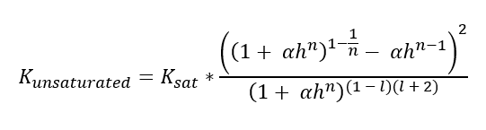

```{r, include = FALSE}
knitr::opts_chunk$set(
  collapse = TRUE,
  echo = FALSE,
  comment = "#>"
)
options(rmarkdown.html_vignette.check_title = FALSE)
```

```{r setup}
library(OBIC);library(ggplot2);library(data.table)
```

---
nocite: |
  @Groenendijk2016, @Tiktak2006, @CommissieDeskundigenMeststoffenwet2017, @Wosten2001, @Geurts2021, @TNO1988
---

## Intorduction
In practice, agricultural soils have multiple functions and contribute to various ecosystem services. Soils ensure good agricultural production, buffer water and nutrients, store carbon, provide a habitat for soil organisms and facilitate aboveground biodiversity. In recent years, therefore, research has been conducted from all angles into the opportunities that sustainable soil management offers for improving the quality of the living environment.  By improving soil management and identifying any bottlenecks in soil quality, a better balance can be found between the various ecosystem services and between agriculture and the environment. Sustainable soil management is therefore not only relevant for farmers and nature managers, but also for water boards and drinking water companies. For them, soil provides relevant ecosystem services such as water storage, water purification and nutrient buffering. Soil properties and soil management therefore influence the quality and availability of groundwater and surface water where they manage or extract water.

The OBIC was developed in 2019 by a consortium of WUR, FarmHack and NMI and is an initiative of Rabobank, a.s.r. and Vitens. The primary focus of the current OBIC (version 1.0) is on the agricultural functions that a soil fulfils. Within the project "Healthy Soil, Healthy Water System", drinking water companies have focused on soil quality assessment from an environmental perspective, focusing on groundwater quality and quantity. An earlier report by Geurts et al. (2021) proposed to expand the OBIC to include functions for groundwater recharge, water storage, nitrogen efficiency, and crop protection product leaching. These functions were to assess how soil and its management contribute to groundwater quality and quantity. The functions were developed and tested in the summer of 2021 on four plots originating from groundwater protection areas managed by Vitens. The results were discussed during a workshop with the participating farmers and stewards, site managers and ecologists. This report describes the newly developed functions as well as their evaluation as a result of the workshop and further data analysis. 


## Ground water recharge
The groundwater recharge is primarily controlled by the precipitation surplus based on crop evaporation. The quality of the soil then determines what part of the precipitation surplus actually infiltrates into the groundwater. To map this groundwater recharge, first the precipitation surplus is calculated, and then this surplus is corrected for two other soil quality characteristics, namely the rate at which water can infiltrate (derived from the unsaturated permeability, I_WRI_K) and the risk of soil sealing (I_P_SE). These soil characteristics give an indication of how much water infiltrates and how easily. The indicator value derived from this is then corrected if the soil is compacted or if the plot is drained. 

If the soil is compacted, the indicator score is reduced by 20% because it is more difficult for water to infiltrate and therefore the water holding capacity will be lower. This correction is independent of soil type, land use or groundwater depth. In reality, the influence of compaction on the infiltration rate depends on the extent of soil compaction and the moisture situation of the soil at the time of a rain shower. There can be great variation here between and within plots. Because this information is not yet available at this level of detail, a generic reduction has been chosen here depending on the risk of soil compaction. 

The correction for a higher drainage flux only takes place with shallower groundwater levels (at groundwater levels IIIb and IV) and the presence of drainage: in that situation the indicator score is reduced by 40%. Under wet and drained conditions a considerable part of the precipitation surplus will flow to the surface water. This concerns a first estimate; further substantiation and detailing (spread), for example based on soil moisture models, is needed for a reliable estimate for different conditions. The depth of drainage in relation to the presence of subsoil compaction (a plough's sole or deeper) also plays a role here. Because this data is not available per plot from generic data, this can only be shaped within the current UBI by getting information through a Soil Condition Score. The correction factors for compaction and drainage are not applied simultaneously, because it is assumed that drainage has a greater impact and compaction is less relevant if the field is already drained.

The calculation of the indicator score can be found in the formula below. Here the precipitation surplus weighs more heavily than the two soil characteristics that influence water infiltration. Therefore, the contribution of soil to groundwater recharge can be calculated via:
(0.7 * Precipitation surplus + 0.15 * Infiltration + 0.15 * Sealing) * cf_compaction/cf_drainage


## Precipitation surplus and unsaturated permeability
The groundwater recharge function,  `calc_gw_recharge()`, uses precipitation surplus and unsaturated permeability, among other things. 
The precipitation surplus function uses long-term weather averages for precipitation and potential evaporation from KNMI. For each crop, the growing season and the Makkink correction factor per month are known (TNO and Commissie voor Hydrologisch onderzoek 1988). Thus, based on the cultivated crop (the cropping plan) and the presence of catch crops, the actual evaporation and precipitation surplus per month can be calculated. The calculation rules can be viewed in more detail on the github page of the Open Soil Index Calculator. The formula for calculating the precipitation surplus is as follows:
P_surplus = P - (ETpot * cf_Makkink).

P stands for precipitation in mm, ETpot is the potential evapo-transpiration in mm and cf_Makkink is the Makkink correction factor. The figure below shows how precipitation surplus is assessed in light of sustainable land use and protection of groundwater recharge. A large proportion of crops have a precipitation surplus of around 400 mm per year. With an annual average precipitation of 850 mm, the precipitation is thus calculated to be equally distributed between crop and groundwater. Therefore, it was decided to assign an indicator score of 1 starting from a precipitation surplus of 400 mm (black line). Since grassland has a higher evapo-transpiration compared to cropland, the score for grassland is calculated using a different formula, it reaches a score of 1 at a precipitation surplus of 250 mm (grey line).

```{r GW recharge, fig.width = 4,fig.height = 3, fig.align = 'center'}

  x = seq(0,600,10)
  y = OBIC::evaluate_logistic(x,0.05,300,2.5)
  y2 = OBIC::evaluate_logistic(x,0.04,130,1.5)
  
  scoring_range <- data.table(class = c("Very low","Low", "Average", "High","Very high"),
                              lower = c(0,0.25,0.5,0.75,1),
                              upper = c(0.25,0.5,0.75,1,1.25))
  
  ggplot() +
    theme_bw() +
    geom_rect(data = scoring_range,aes(xmin = 0, xmax = 600, ymin = lower, ymax = upper, fill = class), alpha = 0.4) +
    geom_line(aes(x,y2), size = 1.2, color = "grey45") +
    geom_line(aes(x,y), size = 1.2) +
    scale_x_continuous(minor_breaks = c(0,100,200,300,400,500,600), breaks =  c(0,100,200,300,400,500,600)) +
    scale_y_continuous(limits = c(0,1.25), minor_breaks = c(0,0.25,0.5,0.75,1,1.25), breaks =  c(0,0.25,0.5,0.75,1,1.25)) +
    labs(x = "Precipitation surplus (mm)", y = "Index score" ) +
    scale_fill_manual(values = c("Very high" = "royalblue1","High" = "limegreen","Average"="yellow","Low"= "orange2", "Very low" = "tomato3"),
                      breaks = c("Very high","High", "Average", "Low","Very low"),
                      name = "")
  
  
```

The OBIC already contains a function for saturated permeability, this was then converted to unsaturated permeability based on Wösten et al. (2001). The formula for this conversion is as follows:
```{r include image of formula unsaturated permeability, echo=FALSE, out.width = '45%', out.height = '45%', fig.align = 'center' }
# include graphic

```

Here Ksat is the saturated permeability in m/d, h is the hydraulic head at the inflection point, the parameters α, n and l determine the shape of the curve and are calculated with the OBIC function pFpara_ptf_Wosten2001.  The logistic function for assessing the indicator score can be found below.

```{r Unsaturated permeability, fig.width = 4,fig.height = 3, fig.align = 'center'}

  x = seq(0,200,10)
  y = evaluate_logistic(x,0.08,50,0.4)

  ggplot() +
    theme_bw() +
    geom_rect(data = scoring_range,aes(xmin = 0, xmax = 200, ymin = lower, ymax = upper, fill = class), alpha = 0.4) +
    geom_line(aes(x,y), size = 1.2) +
    scale_x_continuous(minor_breaks = c(0,50,100,150,200), breaks =  c(0,50,100,150,200)) +
    scale_y_continuous(limits = c(0,1.25), minor_breaks = c(0,0.25,0.5,0.75,1,1.25), breaks =  c(0,0.25,0.5,0.75,1,1.25)) +
    labs(x = "Unsaturated permeability (cm/d)", y = "Index score" ) +
    scale_fill_manual(values = c("Very high" = "royalblue1","High" = "limegreen","Average"="yellow","Low"= "orange2", "Very low" = "tomato3"),
                      breaks = c("Very high","High", "Average", "Low","Very low"),
                      name = "")

```


## Nitrogen use efficiency
The OBIC already contains a function for nitrogen leaching (in the form of nitrate), but it only calculates leaching based on the nitrogen supply capacity of the soil, independent of fertilization practices. The new function, `calc_n_efficiency()`, which aims to protect groundwater quality given agricultural use, calculates the nitrogen surplus from applied manure. The formula for this calculation is as follows: N_surplus = (1 - NUE * cf(P,K,pH)) * N_fertilization * fr_applicationspace - catchcrop

The surplus is calculated by multiplying the amount of applied N by the nitrogen use efficiency, NUE (this is a fraction). If the phosphate and potassium levels are sufficient and the pH of the soil is optimal for crop growth, it is assumed that the NUE is higher. Therefore, when availability for P, K is high and pH is goed (a OBI score for these functions higher than 9), NUE is increased by 10% using the correction factor cf(P,K,pH). This function also includes a variable for the fraction of the application space that is utilized (fr_applicationspace). This is because if the nitrogen supply of the soil is high, less fertilization is needed to meet the crop requirement. In addition, the function assumes an uptake of 75 kg N ha-1 by catch crops (CDM, 2017). For the time being it is assumed that part of this nitrogen is added to the soil organic matter in the year after tillage (thus increasing the N-delivery capacity) and part is taken up by the succeeding crop. Based on the nitrogen surplus and leaching fractions determined for soil type, land use and groundwater level, the leaching to groundwater is calculated. The fraction of the nitrogen surplus that leaches to groundwater as nitrate (mg NO3 L-1 per kg N surplus) were calculated using the modeling tool STONE (Groenendijk et al., 2016). The calculated value for nitrogen leaching is then used to calculate the indicator score. Because there is a small overlap with leaching from N supply, it is worth considering integrating the two functions in the future. 

Once the soil's contribution to high nitrogen utilization has been identified, it can also be assessed in light of protecting groundwater quality. For this purpose, a logistic assessment function is used: soils with a (relative) nitrate leaching higher than 25 mg NO3 L-1 have a high risk of deteriorating groundwater quality and therefore receive a lower soil quality assessment. Since the legally allowed concentration for nitrate in groundwater is 50 mg NO3 L-1, soil quality was chosen to be rated as extremely poor (score = 0) once the leaching exceeds this critical standard. To improve soil quality such that little nitrate leaches out, soil quality is assessed such that the score decreases sharply from a leaching of 20 mg NO3 L-1.


```{r N-efficiency, fig.width = 4,fig.height = 3, fig.align = 'center'}

  x = seq(0,50,1)
  y = ind_nretention(x,'gw')
  
  scoring_range <- data.table(class = c("Very low","Low", "Average", "High","Very high"),
                              lower = c(0,0.25,0.5,0.75,1),
                              upper = c(0.25,0.5,0.75,1,1.25))
  
  ggplot() +
    theme_bw() +
    geom_rect(data = scoring_range,aes(xmin = 0, xmax = 50, ymin = lower, ymax = upper, fill = class), alpha = 0.4) +
    geom_line(aes(x,y), size = 1.2) +
    scale_x_continuous(minor_breaks = c(0,10,20,30,40,50), breaks = c(0,10,20,30,40,50)) +
    scale_y_continuous(limits = c(0,1.25), minor_breaks = c(0,0.25,0.5,0.75,1,1.25), breaks =  c(0,0.25,0.5,0.75,1,1.25)) +
    labs(x = "Nitrogen leaching (mg NO3/L", y = "Index score" ) +
    scale_fill_manual(values = c("Very high" = "royalblue1","High" = "limegreen","Average"="yellow","Low"= "orange2", "Very low" = "tomato3"),
                      breaks = c("Very high","High","Average","Low","Very low"),
                      name = "")

```

## Pesticide leaching
The sensitivity of the soil to pesticides leaching is calculated by the function `calc_pestide_leaching()`, using a meta-model of the leaching model PEARL, as described by Tiktak et al. (2006). This meta-model calculates what fraction of a pesticides leaches to a depth of 1 meter. The formula used for the meta-model is as follows: fr_leaching = exp((-0.34 / 60 * ((vfw + BD * OM * K_om )) / flux ).

In the formula, vfw is the volume fraction of water in m3 m-3 , in the OBIC this is the indicator D_WRI_WHC, BD is the bulk density in kg dm-3, OM is the fraction of organic matter in kg kg-1, Kom is the coefficient for the distribution of pesticides between organic matter and water in dm3 kg-1, finally, flux stands for the vertical water flux in m d-1.

To map the attenuating effect of the soil on the leaching of pesticides, a so-called worst-case scenario is calculated, where the leaching is calculated for a very persistent pesticides. For this purpose, a Kom value of 10 dm3 kg-1 is used (Tiktak et al., 2006). Note that the OBIC hereby provides insight into the role of soil quality in reducing leaching; it does not provide an evaluation of aboveground resource use.
To quantify the role of soil as well as soil management in preventing pesticides of leaching, first each soil is compared to a soil that is unable to degrade or bind pesticides. This is done for soils with extremely low organic matter content. This minimum organic matter content is determined by taking the 0.001 quantile per soil type for all plots in the Netherlands. A relative score is calculated by dividing the leaching fraction by the maximum leaching that could have occurred if the soil had not been properly managed. Because the effect of soil management (including management measures around the use of pesticides) is also taken into account within the OBIC, this information can additionally be used to assess the risk of leaching. If measures are taken to reduce the use of pesticides, such as the use of biological or mechanical weed control or decision support systems, the leaching fraction for the current situation is reduced by 25%.

In a situation with an OM content of 3% and a precipitation surplus of 400 mm, the risk score for all soils except peaty clay is around 0.92. If the OM content is increased to 6% the score goes to a value of 0.84. If measures are taken to use less pesticides, these scores drop to values around 0.7 and 0.6 respectively. With an OM content of 15% (occurring in reclaimed peat soils) and application of measures, the risk score further decreases to a value around 0.5. Therefore, it was decided to assess the leaching risk as shown below. With a lower precipitation surplus, the leaching fraction decreases, because the vertical water flux becomes smaller. Therefore, a higher score can be obtained for pesticide leaching. However, a lower precipitation surplus has a negative effect on the groundwater recharge score, a trade-off. Since a precipitation surplus of 400 mm has been identified as optimal in the precipitation surplus function, this value was used for calibration of this indicator score.
```{r Pesticide leaching, fig.width = 4,fig.height = 3, fig.align = 'center'}

  x = seq(0,1,0.01)
  y = ind_pesticide_leaching(x)
  
  scoring_range <- data.table(class = c("Very low","Low", "Average", "High","Very high"),
                              lower = c(0,0.25,0.5,0.75,1),
                              upper = c(0.25,0.5,0.75,1,1.25))
  
  ggplot() +
    theme_bw() +
    geom_rect(data = scoring_range,aes(xmin = 0, xmax = 1, ymin = lower, ymax = upper, fill = class), alpha = 0.4) +
    geom_line(aes(x,y), size = 1.2) +
    scale_x_continuous(minor_breaks = c(0,0.25,0.5,0.75,1), breaks =  c(0,0.25,0.5,0.75,1)) +
    scale_y_continuous(limits = c(0,1.25), minor_breaks = c(0,0.25,0.5,0.75,1,1.25), breaks =  c(0,0.25,0.5,0.75,1,1.25)) +
    labs(x = "Leaching risk", y = "Index score" ) +
    scale_fill_manual(values = c("Very high" = "royalblue1","High" = "limegreen","Average"="yellow","Low"= "orange2", "Very low" = "tomato3"),
                      breaks = c("Very high","High","Average","Low","Very low"),
                      name = "")
  
```


```{r, include=FALSE}
knitr::write_bib(c(.packages()), "packages.bib")
knitr::write_bib(file = 'packages.bib')
```

# References
